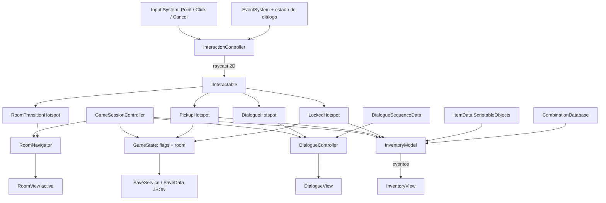

# UNIFRANZ: Protocolo de Admisión — análisis técnico inicial y de viabilidad

**Fecha de corte:** 2026-08-16  
**Proyecto inspeccionado:** `C:\Users\Usuario\EscapeUNIFRANZ`  
**Versión objetivo:** Unity 6000.3.16f1 LTS, C#, Universal 2D / URP 2D  
**Alcance de este documento:** análisis y propuesta; no se implementó ni configuró el juego.

> Conclusión corta: el proyecto es viable si se construye un motor propio **pequeño**, se termina primero un corte vertical de una habitación y se reduce el objetivo recomendado a 3 habitaciones, 6–8 objetos y 4 puzzles. La propuesta original de 5 habitaciones es posible como ampliación, pero no es un punto de partida seguro para estudiantes nuevos.

---

## 1. Resumen ejecutivo

El proyecto local está correctamente creado con Unity `6000.3.16f1`, URP `17.3.0`, un `Renderer2D` y el Input System `1.19.0`. Está prácticamente vacío: contiene la escena de muestra, ajustes de plantilla, cero scripts y cero prefabs. Esto es favorable porque no existe deuda técnica previa, pero también significa que todavía no hay un corte vertical que demuestre la integración.

La versión exacta fue publicada por Unity el 20 de mayo de 2026 y la revisión local coincide también en changeset (`a56f230f6470`) con la [publicación oficial de Unity 6000.3.16f1](https://unity.com/releases/editor/whats-new/6000.3.16f1).

### Veredicto

- **Viabilidad técnica:** sí.
- **Dificultad del alcance original para principiantes:** **7/10**.
- **Dificultad del alcance recomendado:** **6/10**.
- **Enfoque elegido:** **Opción A, construcción propia acotada**, dejando Yarn Spinner como una decisión condicional de segunda fase.
- **Escenas:** una sola escena de gameplay con las habitaciones como raíces activables; menú/créditos pueden ser escenas separadas.
- **Arquitectura:** pocos controladores, modelos C# simples, `ScriptableObject` solo para datos inmutables, eventos para actualizar UI y componentes específicos para puzzles.
- **No construir:** un `PuzzleManager` genérico, un editor visual de nodos, una jerarquía de acciones/condiciones extensible, un servicio por cada sustantivo ni una red de singletons.

### Alcance recomendado

| Elemento | Objetivo recomendado |
|---|---:|
| Duración | 8–12 minutos |
| Habitaciones | 3 |
| Objetos de inventario | 6–8 |
| Puzzles | 4, con un solo encadenamiento de 2–3 pasos |
| Personajes | 2 |
| Diálogo | Mayormente lineal, a lo sumo una decisión corta |
| Combinación de items | Una combinación para demostrar el sistema |
| Guardado | Un único checkpoint/slot solo después del corte vertical |
| Introducción/final | Breves y reutilizando la UI del juego |

El mayor riesgo no es programar el clic: es coordinar inventario, estado, UI, diálogos, animaciones y contenido sin producir rutas imposibles. Por ello la regla de producción debe ser: **una habitación completa y jugable antes de crear las demás**.

---

## 2. Estado actual del proyecto Unity

### Inspección local

| Área | Evidencia encontrada | Evaluación |
|---|---|---|
| Editor | `ProjectSettings/ProjectVersion.txt`: `6000.3.16f1`, revisión `a56f230f6470` | Correcto y coincide con la versión objetivo. |
| Render pipeline | `com.unity.render-pipelines.universal` `17.3.0` | Correcto para Unity 6.3. |
| Renderer | `Assets/Settings/UniversalRP.asset` referencia `Renderer2D.asset` como renderer 0 | Universal 2D configurado. |
| Calidad | Los seis niveles de calidad referencian `UniversalRP.asset` | URP queda activo mediante la configuración por calidad. |
| Graphics Settings | `m_CustomRenderPipeline` global está vacío; hay `UniversalRenderPipelineGlobalSettings` | No es por sí mismo un error porque cada nivel de calidad asigna URP; conviene confirmarlo en el primer build. |
| Escena | `Assets/Scenes/SampleScene.unity`, con `Main Camera` y `Global Light 2D` | Plantilla 2D iluminada válida. |
| Build Settings | Solo `SampleScene` está habilitada | Esperable para un proyecto nuevo. |
| Input | `com.unity.inputsystem` `1.19.0`; `activeInputHandler: 1`; asset `InputSystem_Actions.inputactions` enlazado | Nuevo Input System activo. |
| Actions | Maps genéricos `Player` y `UI`; `UI` ya contiene `Point`, `Click`, navegación y scroll | Punto de partida válido, pero el map `Player` trae muchas acciones irrelevantes. |
| UI | `com.unity.ugui` `2.0.0` | Apropiado para inventario y diálogo de este proyecto. |
| Assets | 2 escenas, 4 `.asset`, 0 `.cs`, 0 `.prefab` | Proyecto sin implementación previa. |
| Tests | `com.unity.test-framework` `1.6.0` instalado | Permite EditMode/PlayMode cuando corresponda. |
| Resolución | Windows 1920×1080; Web 960×600 | Actualmente las relaciones son 16:9 y 16:10: hay que elegir una referencia coherente. |
| Web | Compresión `0`, fallback desactivado | Aún no hay una decisión de publicación; debe probarse en hosting real. |
| Identidad | `DefaultCompany` / `My project` | Pendiente, no bloqueante. |
| Versionado | No existe repositorio Git en esta carpeta ni en sus padres | **Riesgo alto antes de comenzar a producir contenido.** |

Paquetes directos relevantes ya instalados:

- 2D Animation `13.0.5`
- Aseprite Importer `3.0.2`
- PSD Importer `12.0.2`
- SpriteShape `13.0.0`
- Tilemap Extras `6.0.2`
- Input System `1.19.0`
- URP `17.3.0`
- Test Framework `1.6.0`
- Timeline `1.8.12`
- uGUI `2.0.0`
- Visual Scripting `1.9.11`

No hacen falta paquetes de multijugador, IA, Terrain, Visual Scripting ni Timeline para el núcleo point & click. No deben eliminarse todavía: su presencia no impide trabajar y modificar paquetes ahora violaría el principio de estabilizar primero un corte vertical.

### URP 2D

La cadena observada es:

```text
QualitySettings
└── UniversalRP.asset (URP 17.3.0)
    └── Renderer2D.asset
        ├── 4 estilos de mezcla de luces 2D
        ├── material 2D por defecto
        └── sin Renderer Features personalizadas
```

La escena de muestra tiene `Global Light 2D`, por lo que la plantilla es coherente. No se observan materiales, shaders ni features personalizadas que puedan interferir.

### Input System

Debe usarse el Input System instalado, no `Input.GetMouseButtonDown` ni `Input.GetKeyDown` de las referencias antiguas. La interacción necesita como mínimo:

- posición de puntero;
- clic primario;
- cancelar/deseleccionar;
- opcionalmente navegación de UI por teclado.

`InputSystemUIInputModule` es la integración oficial entre Input System y uGUI, y Unity advierte que el código de gameplay debe distinguir entre clic sobre UI y clic sobre el mundo; véase la [documentación oficial de soporte de UI del Input System](https://docs.unity3d.com/Packages/com.unity.inputsystem@1.19/manual/UISupport.html).

### Problemas o decisiones pendientes antes de programar

1. **Crear versionado y una estrategia de respaldo.** Actualmente no hay Git. Este paso debe ocurrir antes de crear escenas reales.
2. **Fijar relación de aspecto objetivo.** Recomiendo diseñar mundo y UI para 16:9, usar `CanvasScaler: Scale With Screen Size` y ensayar 16:10, 4:3 y ultrawide. La resolución Web actual, 960×600, no es 16:9.
3. **Decidir plataforma primaria.** Windows debe ser el build de seguridad para la exposición; Web puede ser secundario.
4. **Crear actions específicas.** Conservar `UI/Point` y `UI/Click`; no construir gameplay sobre el map genérico de correr/saltar/atacar.
5. **Elegir dirección pixel art o ilustración escalada.** Si será pixel art, evaluar después el componente Pixel Perfect; Unity lo ofrece para mantener píxeles estables entre resoluciones ([referencia URP Pixel Perfect](https://docs.unity3d.com/6000.0/Documentation/Manual/urp/2d-pixelperfect-ref.html)).
6. **Hacer un build vacío de Windows y uno Web.** El Editor no valida por sí solo compatibilidad AOT, nombres de escenas, serialización ni hosting.

Los logs locales contienen mensajes de procesos auxiliares de importación/licencia y diagnósticos internos de shaders, pero no contienen indicadores de “scripts have compiler errors”, “compilation failed” o “build failed”. No hay evidencia suficiente para calificarlos como un bloqueo del proyecto.

---

## 3. Análisis de Amazeking

Repositorio: [Stektpotet/Amazeking](https://github.com/Stektpotet/Amazeking). Su `ProjectVersion.txt` indica **Unity 5.5.0f3** y el último código fue empujado en 2018. Es un puzzle-platformer con elementos de point & click, no un adventure point & click clásico.

### Arquitectura observada

```text
Assets/Game/Scripts
├── Manager
│   ├── GameManager
│   ├── LevelManager
│   ├── AudioManager
│   ├── MenuOverlayManager
│   └── SaveLoadManager
├── Trigger
│   ├── InteractionBase / ScriptableInteraction
│   ├── Interactable
│   ├── Trigger
│   ├── Button / Door
│   └── DialogueController
├── Player
├── NPC
└── PlayerStats (ScriptableObject)
```

El `GameManager` es un singleton persistente que localiza otros managers con `FindObjectOfType`. `LevelManager` cambia escenas con `SceneManager.LoadSceneAsync`. La interacción principal no es mouse/hotspot: `InteractionBase` requiere `Collider2D`, detecta proximidad mediante trigger y lee la tecla `E` con el input antiguo ([código de InteractionBase](https://github.com/Stektpotet/Amazeking/blob/master/Assets/Game/Scripts/Trigger/InteractionBase.cs)).

Los puzzles físicos conectan `Trigger`, `Button` y `Door` mediante `UnityEvent`; `DoorInteraction` decide entre eventos “locked” y “open”. El propio documento del proyecto reconoce que la abundancia de `UnityEvent` volvió las relaciones abstractas y difíciles de depurar. Esta observación sigue siendo especialmente valiosa.

### Inventario, rooms, diálogo y estado

- **Inventario:** no hay un inventario adventure reutilizable. Los objetos son elementos físicos del platformer.
- **Interacciones:** `Interactable` expone eventos de ataque/uso y aplica fuerzas físicas.
- **Puzzles:** triggers físicos y eventos de Inspector.
- **Habitaciones:** niveles completos cargados en orden por build index.
- **Diálogos:** arrays de texto serializados en un `DialogueController`, typewriter mediante coroutine y callbacks por etapa ([código](https://github.com/Stektpotet/Amazeking/blob/master/Assets/Game/Scripts/Trigger/DialogueController.cs)). No hay branching general.
- **Estado:** `PlayerStats` es un `ScriptableObject`; el guardado usa `BinaryFormatter` ([SaveLoadManager](https://github.com/Stektpotet/Amazeking/blob/master/Assets/Game/Scripts/Manager/SaveLoadManager.cs)). No representa el estado de una aventura.

### Ideas que siguen siendo buenas

- Componentes pequeños como `Door`, `Button` e interacción repetible.
- Separar el cambio de nivel de los objetos que solicitan el cambio.
- Añadir gizmos/herramientas solo para una necesidad concreta y repetitiva.
- Poner callbacks visuales/sonoros cerca del objeto que los reproduce.
- Reconocer que una red grande de eventos de Inspector perjudica el debugging.

### Partes obsoletas o inadecuadas

- Unity 5.5, shaders y assets de esa época.
- `Input.GetKeyDown` y teclas codificadas.
- uGUI `Text`/`InputField` antiguos.
- `FindObjectOfType` como service locator y múltiples singletons.
- `BinaryFormatter`, que no debe usarse para datos de guardado modernos.
- `UnityEvent` como columna vertebral de toda la lógica.
- Estado runtime guardado en un `ScriptableObject` asset.
- Acoplamiento a build indexes para progresión.

### Qué reinterpretar para Unity 6000.3.16f1

Reinterpretar **la composición por componentes**, no el código: `IInteractable`, `PickupHotspot`, `LockedDoorHotspot`, eventos C# para actualizar vistas, Input System y JSON de un DTO de guardado. `SceneManager.LoadSceneAsync` sí continúa siendo una API válida, pero para este alcance no hace falta usar una escena por habitación.

No aparece una licencia reconocida por GitHub; por tanto, además de su antigüedad, no debe copiarse código.

---

## 4. Análisis de TURKUAZ

Repositorio: [efeegrkm/TURKUAZ](https://github.com/efeegrkm/TURKUAZ). Usa **Unity 6000.0.48f1**, el feature set 2D y el Input System `1.14.0`. Es la referencia funcional más cercana al objetivo: aventura 2D, inventario, uso contextual, diálogo y escenas.

### Arquitectura real

```text
Assets/Scripts
├── StartingScene
│   ├── ClickDetector
│   ├── InventoryManager
│   ├── CameraSwitcher
│   └── AudioManager
├── BeachScripts
│   ├── B_ClickDetector
│   ├── ActionMethots
│   ├── BeachManager
│   └── Dialogues
├── Textal
│   ├── Dialogue
│   ├── ScriptPrinter
│   ├── Decidor
│   └── DecisionMaker
└── SceneTransitionManager
```

La organización es principalmente por escena. Existen varios singletons globales y referencias públicas/serializadas. Hay dos generaciones del sistema de clic:

1. `ClickDetector`: gran script con decenas de colliders, objetos visuales, audio, estados, diálogos y ramas de puzzle.
2. `B_ClickDetector`: mejora parcial; define una lista serializable de `ClickableZone` con collider, `UnityEvent` y niveles aceptados. Convierte `Input.mousePosition` a mundo y usa `Collider2D.OverlapPoint` ([B_ClickDetector](https://github.com/efeegrkm/TURKUAZ/blob/main/Assets/Scripts/BeachScripts/B_ClickDetector.cs)).

Aunque el paquete Input System está instalado, ambos detectores leen `Input.GetMouseButtonDown`, es decir, el input legado.

### Inventario

`InventoryManager` mantiene diez slots serializados, un `itemPool`, el slot seleccionado, prefab de icono y resaltado visual ([código](https://github.com/efeegrkm/TURKUAZ/blob/main/Assets/Scripts/StartingScene/InventoryManager.cs)). Proporciona:

- añadir al primer slot libre;
- seleccionar slot;
- consumir el seleccionado;
- `HasItem(index)`;
- `UseItemWith(index)`;
- persistencia del objeto/UI mediante `DontDestroyOnLoad`.

Aspectos útiles:

- selección visible;
- separar la UI del objeto de mundo;
- API explícita para consultar y consumir;
- no consumir si la interacción falla.

Aspectos frágiles:

- `InventoryItem` no es `ScriptableObject`; guarda `itemName` y un prefab de icono.
- Las comparaciones dependen de strings como `"VanKey"` o `"Lighter"`.
- `itemPoolIndex` convierte el orden del Inspector en identidad del objeto.
- Modelo, UI, audio y persistencia conviven en el mismo manager.
- `ClearAllSlots()` se llama dentro del bucle que inicializa cada slot.
- El archivo runtime importa `UnityEditor`; esto puede romper builds Player.
- El UI persistente conserva referencias a cámaras/escenas y obliga a reconfigurarlas.

### Item + hotspot y puzzles

La lógica vive directamente en `ClickDetector` y `ActionMethots`. Ejemplos:

- llave seleccionada + caravana bloqueada → consume llave y cambia `caravanLocked`;
- recoger dos palos → consume uno y crea un palo grueso;
- palo grueso + slot de antorcha → activa mango;
- tela + mango → activa antorcha preparada;
- encendedor + antorcha → consume encendedor y activa luz.

El puzzle de la antorcha demuestra bien el loop buscado, pero su implementación mezcla en un método las consultas de inventario, flags, textos, audio y cambios visuales ([ActionMethots](https://github.com/efeegrkm/TURKUAZ/blob/main/Assets/Scripts/BeachScripts/ActionMethots.cs)). El campo entero `actionLevel` representa demasiadas dimensiones de estado a la vez; una transición incorrecta puede deshabilitar hotspots no relacionados.

### Movimiento, habitaciones y UI

`SceneTransitionManager` conserva UI, audio y EventSystem, carga escenas aditivamente, desactiva un root etiquetado `SceneRoot`, cambia la escena activa y reasigna cámaras ([código](https://github.com/efeegrkm/TURKUAZ/blob/main/Assets/Scripts/SceneTransitionManager.cs)). Es funcional, pero exige:

- índices de build del 0 al 10;
- tags exactos;
- raíces únicas;
- cámaras y Canvas reasignados;
- singletons presentes en el orden correcto;
- suscripciones correctas a `sceneLoaded`.

Para cinco fondos 2D pequeños, esa complejidad no se justifica inicialmente.

### Diálogos y decisiones

`Dialogue` es una clase C# pequeña; `Dialogues` construye arrays completos dentro del código, los encola y ejecuta efectos al llegar a números de línea concretos. `ScriptPrinter` maneja retratos y typewriter. `Decidor` convierte strings como `GO_BEACH_SCENE` en acciones mediante un `switch` ([Decidor](https://github.com/efeegrkm/TURKUAZ/blob/main/Assets/Scripts/Textal/Decidor.cs)).

Es sencillo para una demo, pero obliga a recompilar para cambiar texto, une contenido con lógica y hace frágiles los triggers por índice de línea.

### Estado y dependencias

- No se observó sistema de guardado.
- El estado está distribuido en muchos bools, arrays de bools y `actionLevel`.
- Los sistemas acceden entre sí mediante `Instance`.
- `UnityEvent` conecta zonas con acciones.
- `Unity.VisualScripting` se importa en un script aunque no es necesario para la lógica mostrada.
- `UnityEditor` aparece en archivos runtime como `InventoryManager` y `Decidor`.

### Qué tomar y qué rechazar

**Tomar como inspiración:** selección de inventario visible, contexto “item seleccionado + hotspot”, bloqueo temporal de input mientras corre una acción, feedback al usar un objeto incorrecto, raíces de habitación claras y transiciones con fade.

**No copiar:** detectores monolíticos, strings como identidad, índices como IDs, `actionLevel` global, diálogos en C#, singletons encadenados, UI persistente con referencias de escena y `UnityEvent` como lógica principal.

El README declara que la redistribución no está permitida. El análisis debe mantenerse conceptual.

---

## 5. Análisis de Yarn-Pile

Repositorio: [zephyo/Yarn-Pile](https://github.com/zephyo/Yarn-Pile). Usa **Unity 2020.1.7f1**, URP `8.2.0`, Input System `1.0.0`, Cinemachine `2.6.2`, DOTween y una copia incrustada de una rama de desarrollo de Yarn Spinner.

### Arquitectura y narrativa

`MainSingleton` conserva `DialogueRunner`, input, inventario, audio, notificaciones y referencias regeneradas por escena. `SceneControl` registra el comando Yarn `Load` y cambia escenas aditivas. Los `.yarn` controlan escena, música, personajes, reloj, inventario, opciones y variables ([ejemplo Start.yarn](https://github.com/zephyo/Yarn-Pile/blob/master/Assets/Dialogue/Start.yarn)).

El patrón principal es:

```text
Yarn Script
├── presenta líneas y opciones
├── evalúa variables/visited()
└── emite comandos
    ├── Load
    ├── Take / Drop
    ├── Show / Hide
    ├── PlayMusic
    └── SetTime
        ↓
DialogueRunner llama handlers C#
```

Esto separa mejor escritura y código que TURKUAZ. `ItemData` es `ScriptableObject` con icono, descripción y efectos sobre variables Yarn. `InventoryManager` usa un modelo de cantidades, dispara eventos y deja que `InventoryUI` actualice la vista ([InventoryManager](https://github.com/zephyo/Yarn-Pile/blob/master/Assets/Scripts/Inventory/InventoryManager.cs)). Son ideas vigentes.

### Persistencia

`CustomStorage` extiende el almacenamiento de variables Yarn, guarda escena, tiempo, inventario, variables y nodos visitados. Sin embargo, serializa mediante `BinaryFormatter`; esa implementación no debe trasladarse a Unity 6 ([CustomStorage](https://github.com/zephyo/Yarn-Pile/blob/master/Assets/Scripts/Yarn/CustomStorage.cs)).

### Vigencia

Yarn-Pile no debe abrirse como plantilla del proyecto actual ni debe copiarse su Yarn Spinner incrustado. Además de su antigüedad, depende de una API y una personalización de UI de 2020, DOTween, diccionarios serializables de terceros y varias convenciones rígidas.

La integración oficial actual es Yarn Spinner 3; la documentación declara compatibilidad con Unity **2022.3 o posterior**, por lo que Unity 6.3 está dentro de su rango ([primeros pasos oficiales](https://docs.yarnspinner.dev/yarn-spinner-for-unity/overview)). A la fecha de corte, GitHub muestra `v3.2.7` como versión más reciente ([releases oficiales](https://github.com/YarnSpinnerTool/YarnSpinner-Unity/releases)). Si se adopta, debe instalarse una versión oficial fijada, no código de Yarn-Pile.

### ¿Yarn Spinner simplifica o complica?

| Situación | Efecto |
|---|---|
| Muchas líneas y cambios frecuentes de guion | Simplifica: contenido fuera de C#, recompilación narrativa y nodos claros. |
| Opciones, condiciones y variables narrativas reales | Simplifica: branching y variables son capacidades nativas. |
| Solo conversaciones lineales cortas | Complica: añade paquete, lenguaje, assets, presenters y puente con estado. |
| Equipo nuevo aprendiendo Unity, C# y Yarn a la vez | Complica el debugging y la división de responsabilidades. |
| Necesidad de comandos que alteran puzzles | Puede ayudar, pero también crea una segunda fuente de verdad. |

**Decisión:** **C, dejarlo para una segunda fase**, con una puerta de decisión concreta: adoptarlo solo si el guion validado tiene varias ramas persistentes o si editar el diálogo en assets simples ya es un cuello de botella. Para el MVP, un sistema lineal propio es menor y más transparente.

---

## 6. Análisis de los sistemas de diálogo

### Proyecto moderno: oykuyamakov/UnityDialogueSystem

Repositorio: [oykuyamakov/UnityDialogueSystem](https://github.com/oykuyamakov/UnityDialogueSystem). Usa **Unity 2022.3.62f3** y presenta un editor de grafos con UI Toolkit/`UnityEditor.Experimental.GraphView`.

Arquitectura:

- `DialogueContainer` (`ScriptableObject`) conserva nodos NPC, jugador e inicio.
- Los nodos tienen GUID y posición gráfica.
- Las líneas aceptan `ConditionSet` y `TriggerSet`.
- `Olay` es una jerarquía polimórfica serializada con `[SerializeReference]` para item, jugador, ubicación, música y objeto.
- Las condiciones acumulan satisfacción runtime y pueden filtrar por ubicación.
- Los nodos NPC admiten modos, prioridades y selección de la línea condicional satisfecha.
- `GraphSaveUtility` convierte el grafo del Editor en un asset bajo `Resources`.
- La serialización JSON depende de `Newtonsoft.Json-for-Unity` instalado desde GitHub.

Conceptos útiles para nuestro proyecto:

- separar **condición**, **línea** y **efecto**;
- GUID/ID estable en vez de posiciones o nombres visuales;
- validación antes de guardar;
- cachés runtime que se reconstruyen desde datos serializados;
- prioridades cuando varias respuestas pueden cumplirse.

Problemas para adopción directa:

- `GraphView` sigue marcado por Unity como experimental y puede cambiar o desaparecer ([documentación de Unity 6](https://docs.unity3d.com/6000.0/Documentation/ScriptReference/Experimental.GraphView.SearchWindowContext.html)).
- El repositorio implementa sobre todo datos/editor; no ofrece en su árbol un runner/presenter/UI de juego completo comparable a Yarn Spinner.
- `Resources` y un grafo visual son complejidad innecesaria para unas pocas conversaciones.
- Los enums `NpcName`, `ItemName` y `Location` obligan a tocar código para añadir contenido.
- Algunos archivos runtime incluyen `using UnityEditor` fuera de una carpeta `Editor`.
- `ObjectOlay` conserva referencias a `GameObject`, difíciles de hacer persistentes y portables entre escenas.
- El runtime modifica estado en estructuras que viven dentro del `ScriptableObject`; exige un reset cuidadoso y puede producir “estado pegado” en Editor.
- GitHub no detecta una licencia formal, aunque el README diga que es libre de usar.

**Decisión:** adoptar los conceptos de separación y validación, no el sistema ni su editor.

### Proyecto histórico: 0xnahual/UnityDialogueSystem

Repositorio: [0xnahual/UnityDialogueSystem](https://github.com/0xnahual/UnityDialogueSystem). El código fue empujado por última vez en 2019, no contiene `ProjectVersion.txt` ni `Packages/manifest.json`, y está bajo MIT.

Usa una organización tipo modelo/controlador/componente: `Conversation`, `ConversationStatus`, `Dialogue`, `Sentence`, controladores y componentes de escena. Fue una buena separación para su época. Sin embargo:

- usa `UnityEngine.UI.Text` y crea un `GameObject` por letra;
- lee una tecla por string con el input antiguo;
- localiza dependencias con rutas `GameObject.Find`;
- importa `UnityEditor` en un modelo runtime;
- depende de prefabs y nombres globales exactos;
- las conversaciones progresan por índices y estados enlazados;
- no ofrece branching moderno basado en condiciones y opciones.

Sirve como comparación histórica: demuestra que separar datos de presentación es valioso, pero no debe adoptarse.

### Sistema recomendado de diálogo

Para el primer corte:

```text
DialogueSequenceData (ScriptableObject, datos)
└── DialogueLine[]
    ├── speakerId
    ├── text
    ├── portrait opcional
    └── evento lógico opcional identificado, no UnityEvent arbitrario

DialogueController (MonoBehaviour)
├── inicia/avanza/finaliza secuencia
├── bloquea InteractionController mientras habla
└── solicita efectos a GameSession/RoomNavigator mediante APIs explícitas

DialogueView (MonoBehaviour)
└── retrato, nombre, texto, typewriter, continuar y hasta 2 opciones
```

No construir un grafo visual. Si aparecen branching y variables suficientes para justificarlo, reemplazar `DialogueSequenceData` por Yarn Spinner 3 detrás de una interfaz pequeña (`IDialogueService`) y conservar el resto del juego.

---

## 7. Referencia conceptual Inkagames/SPACE

La existencia de **SPACE — Simple Point and Click Engine** está documentada por los propios comentarios de Inkagames en *Obama Saw Game* de 2009: afirman usar su engine SPACE ([publicación histórica en Newgrounds](https://www.newgrounds.com/portal/view/485701)). Fuentes históricas secundarias atribuyen su primer uso a un juego de 2007. No se encontró un repositorio público verificable ni documentación técnica del motor; no debe especularse sobre su código interno.

Sí es observable su interfaz:

- acciones/verbos como mano, boca y ojo;
- objetos visibles recogibles;
- inventario accesible;
- seleccionar o arrastrar un item y aplicarlo sobre escena/u otro item;
- conversaciones que entregan información u objetos;
- navegación por pantallas;
- encadenamiento estricto de estados;
- feedback para acción inválida;
- en algunos títulos, una guía dinámica para evitar bloqueo. La página histórica de *Santa Claus Saw Game* describe explícitamente los verbos de mano, boca y ojo ([Kongregate](https://www.kongregate.com/en/games/inkagames/santa-claus-saw-game)).

El patrón a reinterpretar es:

```text
Observar → descubrir pista → recoger → seleccionar → aplicar
        → recibir feedback → cambiar estado → abrir la siguiente posibilidad
```

No hace falta copiar la interfaz de verbos. Para UNIFRANZ es suficiente:

- clic sin item: observar/recoger/hablar/abrir según el hotspot;
- clic con item seleccionado: intentar usarlo;
- clic en inventario: seleccionar/deseleccionar;
- combinación de item: una acción deliberada desde el inventario;
- mensaje corto ante uso incorrecto.

No se deben descargar SWF, extraer assets, descompilar lógica ni reconstruir personajes, música o puzzles. SPACE es referencia de **loop**, no dependencia ni plantilla.

---

## 8. Comparación de enfoques

### Matriz

| Criterio | A. Propio acotado | B. Toolkit completo | C. Híbrido con Yarn |
|---|---|---|---|
| Compatibilidad controlable | Alta: se escribe para 6000.3.16f1 | Variable según toolkit/versión | Alta si se fija Yarn oficial actual |
| Curva inicial | Media | Alta por aprender el framework | Media-alta por Unity + C# + Yarn |
| Demostración académica de programación | Alta | Media/baja | Alta en gameplay, media en diálogo |
| Velocidad del primer clic | Media | Alta | Media |
| Velocidad después de dominarlo | Alta para este alcance | Alta | Alta si hay mucho diálogo |
| Dependencia externa | Baja | Alta | Media |
| Riesgo de overengineering | Controlable | Alto: toolkit mayor que el juego | Medio |
| Debugging | Directo si la arquitectura es pequeña | Requiere entender internals y tooling | Dos capas: Yarn + C# |
| Personalización | Total | Dentro de las convenciones del toolkit | Total en gameplay, estructurada en narrativa |
| Recomendación | **Elegida** | No para el núcleo | Candidata de fase 2 |

### Opción A — construcción propia

**Ventajas:** el equipo comprende cada sistema; se ajusta exactamente al curso; no depende de compatibilidad ajena; el juego necesita pocas variantes; facilita explicar la arquitectura durante la exposición.

**Desventajas:** hay que construir y probar selección, inventario, flags y guardado; es fácil intentar crear un engine genérico.

**Dificultad:** media si se limita a cuatro tipos de hotspot; alta si se añaden editores visuales, navegación de personaje, verbos múltiples o scripting genérico.

### Opción B — toolkit/framework existente

**PowerQuest.** Es especializado en aventuras 2D, con editor de rooms/personajes/inventario y scripting. Su historial oficial indica estable `0.20.8` y beta `0.20.9`; esta beta añade arreglos de Unity 6, pero el autor dice que Unity 2020 sigue siendo la versión principal y que las pruebas de Editor en Unity 6 fueron limitadas ([historial oficial](https://powerquest.powerhoof.com/version_history.html)). En Unity 6000.3.16f1 exacto, el riesgo es demasiado alto para adoptarlo sin un prototipo aislado.

**Adventure Creator.** Es un toolkit comercial y completo con hotspots, inventario, variables, diálogo, guardado, pathfinding y ActionLists ([sitio oficial](https://adventurecreator.org/)). La versión actual tiene soporte activo para Unity 6.3, pero requiere la release correcta; el propio soporte indica que versiones antiguas no compilan en 6.3 ([foro oficial](https://adventurecreator.org/forum/discussion/16730/issue-upgrading-to-unity-6000-3)). Es más maduro que PowerQuest en Unity 6.3, pero introduce un “engine dentro del engine”, convenciones, ajustes de proyecto y curva de aprendizaje mayores que el juego.

**Cuándo elegir toolkit:** si la prioridad absoluta fuera terminar mucho contenido con mínima programación propia, hubiera tiempo para aprenderlo y se hiciera una prueba de build temprana. No es la prioridad declarada de esta materia.

### Opción C — híbrido

Interacción/inventario/puzzles propios y Yarn Spinner para diálogos es una combinación sensata cuando el guion contiene branching sustancial. Yarn Spinner actual proporciona runner, presenters, variables, opciones y comandos; el `DialogueRunner` es el puente oficial entre scripts y UI ([documentación](https://docs.yarnspinner.dev/components/dialogue-runner)).

Para el alcance presente, la dependencia todavía no se gana su coste. Puede convertirse en la mejor opción tras validar el guion.

### Elección

**Elegiría Opción A, pero estrictamente acotada.** No construiría un engine general: cuatro componentes de interacción, un modelo de inventario, un estado y una UI. Revaluaría el salto a Opción C al terminar la primera conversación real. No elegiría un toolkit completo para la entrega universitaria.

---

## 9. Arquitectura recomendada

### Principios

1. Una sola fuente de verdad para estado e inventario.
2. Datos de contenido separados de estado mutable.
3. UI como vista: nunca decide si un puzzle está resuelto.
4. Puzzles como componentes específicos y legibles, no como lenguaje genérico.
5. IDs estables para guardar; nunca índices de build o de arrays como identidad.
6. Eventos C# para “el modelo cambió”; llamadas directas para comandos importantes.
7. Dependencias serializadas desde un único `GameRoot`; sin búsqueda global rutinaria.

### Sistemas concretos

| Pieza | Tipo | Responsabilidad | Decisión |
|---|---|---|---|
| `GameSessionController` | `MonoBehaviour` | Posee `GameState`, inventario y referencias de servicios; inicia/reinicia sesión | Sustituye a un `GameManager` omnipotente. No singleton global. |
| `GameState` | Clase C# serializable | Flags completados, habitación actual y versión de esquema | No `MonoBehaviour`, no `ScriptableObject`. |
| `InteractionController` | `MonoBehaviour` | Lee Input System, ignora UI/diálogo, raycast 2D, crea contexto y llama al objetivo | Necesario. |
| `IInteractable` | Interfaz | `Interact(context)` | Desacopla input de pickups, puertas, NPC y puzzles. |
| `InventoryModel` | Clase C# | Añadir, quitar, consultar, seleccionar y combinar IDs | Probable objetivo principal de tests. |
| `InventoryController` | `MonoBehaviour` | Une modelo, catálogo y comandos del mundo | Necesario. |
| `InventoryView` / `InventorySlotView` | `MonoBehaviour` | Renderiza slots y selección | Sin lógica de puzzle. |
| `ItemData` | `ScriptableObject` | ID, nombre, descripción, icono, consumible | Recomendado. Inmutable en runtime. |
| `ItemCatalog` | `ScriptableObject` o lista serializada | Resolver ID → `ItemData`; validar unicidad | Un catálogo basta. |
| `CombinationDatabase` | `ScriptableObject` | Recetas A+B→resultado | Solo si se confirma combinación item+item. |
| `RoomNavigator` | `MonoBehaviour` | Activa una `RoomView`, desactiva la anterior y emite cambio | Sustituye `RoomManager` complejo. |
| `RoomView` | `MonoBehaviour` | ID y raíz visual de habitación | Necesario. |
| `DialogueController` | `MonoBehaviour` | Ejecuta secuencias y bloquea interacción | Pequeño. |
| `DialogueView` | `MonoBehaviour` | Presenta texto, retrato y opciones | Separada del controller. |
| `DialogueSequenceData` | `ScriptableObject` | Contenido de conversación | Suficiente para MVP. |
| `SaveService` | Clase C# | Convierte estado a DTO JSON y viceversa | Fase posterior; no manager persistente. |
| `AudioController` | `MonoBehaviour` | Uno o dos canales y métodos simples | No necesita sistema de buses dinámico al inicio. |

### Entidades de interacción

En vez de un `PuzzleManager`, usar pocos componentes:

- `ObserveHotspot`: devuelve descripción/feedback.
- `PickupHotspot`: añade item, marca flag y oculta el sprite.
- `LockedHotspot`: exige item/flag, consume opcionalmente y cambia estado.
- `DialogueHotspot`: inicia una secuencia.
- `RoomTransitionHotspot`: solicita cambio de habitación si se cumple una condición.
- uno o dos componentes específicos para puzzles únicos, por ejemplo `CodePanelPuzzle`.

Un `Door` puede ser un `LockedHotspot` configurado, no necesita herencia propia salvo que tenga comportamiento especial.

### Qué combinar y qué separar

- Combinar `GameManager` + `PuzzleManager` en **ninguno**: el estado pertenece a `GameSessionController`; cada puzzle conoce solo lo que necesita.
- Combinar `RoomManager` + transiciones en `RoomNavigator`.
- Separar `InventoryModel`, `InventoryController` e `InventoryView` porque tienen pruebas, lifecycle y responsabilidades distintas.
- Separar `DialogueController` de `DialogueView`.
- Mantener audio pequeño dentro de `AudioController`; no crear mezclador dinámico, playlists o pooling.
- No crear `UIManager`; cada vista conoce su panel y `GameSessionController` coordina solo estados globales de input.

### Eventos e interfaces

Usar eventos C# para:

- inventario cambió;
- selección cambió;
- flag cambió;
- habitación cambió;
- diálogo empezó/terminó.

Usar llamadas directas para:

- intentar interacción;
- añadir/consumir item;
- solicitar cambio de habitación;
- guardar/cargar.

Usar `IInteractable` en el límite entre detección y objeto. No crear interfaces para cada manager ni un event bus global.

### Datos vs. lógica

| Debe ser dato | Debe ser lógica |
|---|---|
| Item ID, nombre, descripción, icono, si es consumible | Reglas para añadir/consumir/seleccionar |
| Texto, speaker y retrato | Avanzar, bloquear input, aplicar efecto |
| IDs de receta y resultado | Validar combinación y mutar inventario |
| Room ID y título | Activar una sola habitación |
| Item/flag requerido por una puerta configurable | Decidir éxito, consumo y cambio de estado |
| Clips y referencias visuales | Cuándo reproducirlos |

`ItemData` como `ScriptableObject` es apropiado para datos compartidos. Unity define `ScriptableObject` como contenedor de datos asset y aclara que en un build desplegado no es un mecanismo de guardado runtime ([manual oficial](https://docs.unity3d.com/6000.1/Documentation/Manual/class-ScriptableObject.html)). Por ello **no** debe guardar `isOwned`, `selected`, cantidad ni estado de puzzle.

### Estructura de carpetas propuesta

```text
Assets/_Project
├── Art
├── Audio
├── Data
│   ├── Items
│   ├── Dialogues
│   └── Combinations
├── Prefabs
│   ├── UI
│   └── Interaction
├── Scenes
│   ├── Boot_Menu.unity       (opcional)
│   ├── Gameplay.unity
│   └── Credits.unity         (opcional)
├── Scripts
│   ├── Core
│   ├── Interaction
│   ├── Inventory
│   ├── Rooms
│   ├── Dialogue
│   ├── Puzzles
│   ├── Persistence
│   └── UI
└── Tests
    ├── EditMode
    └── PlayMode
```

No crear assemblies, paquetes internos ni namespaces por cada carpeta el primer día. Un namespace de proyecto y, cuando existan tests, un assembly runtime y otro de tests son suficientes.

---

## 10. Diagrama de arquitectura



Flujo de autoridad:

```text
Input solicita → dominio valida → estado muta → eventos notifican → vistas representan
```

Nunca al revés: un icono de UI oculto no significa que el item haya sido consumido; el modelo debe cambiar primero.

---

## 11. Flujo técnico de interacción

1. El Input System produce `Point` y `Click`.
2. `InteractionController` descarta el clic si:
   - el puntero está sobre UI;
   - hay un diálogo/modal abierto;
   - una transición/animación bloqueante está en curso.
3. Convierte la posición de pantalla a un raycast 2D.
4. Busca un componente `IInteractable` en el collider alcanzado.
5. Crea un `InteractionContext` con:
   - item seleccionado o ninguno;
   - referencia de solo lectura a inventario/estado;
   - habitación actual.
6. El hotspot decide entre observar, recoger, hablar, usar item o rechazar.
7. Toda mutación pasa por APIs del dominio:
   - `InventoryModel.TryAdd/TryRemove`;
   - `GameState.SetFlag`;
   - `RoomNavigator.TryGoTo`;
   - `DialogueController.Play`.
8. Los modelos emiten eventos.
9. UI, sprite, sonido y animación reaccionan.
10. Si hubo una acción bloqueante, al terminar libera el input.

Casos a definir desde el principio:

- clic sin target;
- clic sobre UI encima de un hotspot;
- item seleccionado incorrecto;
- inventario lleno;
- doble clic rápido;
- clicar mientras escribe el diálogo;
- target ya resuelto;
- item consumible vs. reutilizable.

---

## 12. Flujo técnico de un puzzle

Ejemplo: llave de aula y puerta.

```text
PickupHotspot(llave_aula)
    ↓ clic sin item
comprueba flag LlaveAulaRecogida == false
    ↓
InventoryModel.TryAdd("llave_aula")
    ↓ éxito
GameState.SetFlag(LlaveAulaRecogida)
    ↓
oculta/desactiva pickup + reproduce feedback
    ↓
InventoryView recibe InventoryChanged
    ↓
jugador selecciona llave en InventoryView
    ↓
InventoryModel.SelectedItemId = "llave_aula"
    ↓
clic en LockedHotspot(puerta_aula)
    ↓
InteractionController entrega selectedItemId
    ↓
puerta verifica item requerido y PuertaAulaAbierta == false
    ↓ éxito
InventoryModel.TryRemove("llave_aula")
GameState.SetFlag(PuertaAulaAbierta)
    ↓
puerta cambia sprite/animación y collider
    ↓
AudioController reproduce apertura
    ↓
RoomTransitionHotspot queda habilitado
```

Si la llave es incorrecta, el inventario no cambia y se presenta feedback. Si el inventario estaba lleno al recoger, la llave tampoco desaparece. Al cargar una partida, `PickupHotspot` y puerta reconstruyen su apariencia desde flags durante la inicialización; no se guarda directamente si el sprite estaba activo.

Este puzzle no necesita `PuzzleManager`: sus invariantes están repartidas entre un pickup configurable, el modelo de inventario, un flag y una puerta configurable.

---

## 13. Manejo de estados

### Comparación

| Enfoque | Ventaja | Problema | Uso recomendado |
|---|---|---|---|
| Bools directos en muchos componentes | Muy simple al principio | Se dispersan, no se guardan juntos y crean dependencias | Solo estado visual local derivable. |
| Diccionario `string → bool` | Flexible y fácil de serializar como pares | Typos, renombrados y estados inválidos | Evitar strings libres. |
| `ScriptableObject` mutable | Inspector cómodo y acceso compartido | Puede conservar cambios en Editor; no es save runtime | No usar para estado de sesión. |
| Clase `GameState` | Una fuente de verdad, testeable, serializable | Hay que exponer API y restaurar vistas | **Base recomendada.** |
| IDs estables | Referencias seguras para save y contenido | Requiere catálogo/validación | **Recomendado.** |

### Solución proporcional

Usar una clase `GameState` con:

- `schemaVersion`;
- `currentRoomId`;
- conjunto runtime de `GameFlagId`;
- inventario mediante IDs estables;
- opcionalmente historial mínimo necesario.

Para unos 15–25 hitos, `GameFlagId` puede ser un enum:

```text
LlaveAulaRecogida
PuertaAulaAbierta
ComputadoraEncendida
EstudianteRescatado
CodigoResuelto
```

El runtime usa un conjunto para `HasFlag`/`SetFlag`; `SaveData` guarda una lista de esos IDs porque el serializador de Unity no serializa directamente todas las colecciones de dominio. Los nombres deben representar hechos pasados/estado alcanzado, no instrucciones ambiguas.

Para objetos, `ItemData.Id` debe ser un string estable, legible y no localizado (`"llave_aula"`). El nombre visible puede cambiar sin romper saves.

### Persistencia

`SaveData` es un DTO separado:

```text
schemaVersion
currentRoomId
completedFlags[]
inventoryItemIds[]
selectedItemId (opcional; también puede limpiarse al cargar)
```

Guardar JSON en `Application.persistentDataPath`, con escritura temporal + reemplazo cuando la plataforma lo permita. No guardar referencias a `GameObject`, sprites ni `ScriptableObject`; se reconstruyen por ID.

Para una demo de 10 minutos, un único slot es suficiente. El MVP puede no guardar: primero hay que demostrar que una sesión completa funciona. En Web, almacenamiento y archivos están condicionados por el sandbox del navegador/IndexedDB, y Safari dentro de iframe tiene limitaciones ([compatibilidad Web de Unity](https://docs.unity3d.com/6000.0/Documentation/Manual/webgl-browsercompatibility.html)).

---

## 14. Estrategia de escenas

| Alternativa | Ventajas | Riesgos | Veredicto |
|---|---|---|---|
| 1. Una escena por habitación | Jerarquías pequeñas, trabajo paralelo y memoria selectiva | Persistencia, referencias perdidas, transiciones, bootstrap y pruebas cruzadas | Segunda opción si el contenido crece. |
| 2. Una escena grande con varias habitaciones | UI/servicios únicos, referencias simples, transiciones instantáneas, estado fácil | Más memoria, jerarquía y posibles conflictos de escena | **Recomendada para el gameplay.** |
| 3. Persistente + aditivas | Separación y servicios persistentes | Orden de carga, escena activa, duplicados, cámaras, EventSystem, descarga y debugging | Overengineering para 3–5 habitaciones 2D. |

### Recomendación

Usar una escena `Gameplay.unity`:

```text
Gameplay
├── GameRoot
├── MainCamera
├── EventSystem
├── UI
└── Rooms
    ├── Recepcion_Room
    ├── Pasillo_Room
    ├── Aula_Room
    ├── Laboratorio_Room (extra)
    └── Rescate_Room (extra)
```

`RoomNavigator` garantiza que solo una raíz esté activa. Cada habitación debe ser autocontenida bajo su root. Los fondos 2D pueden ocupar memoria, pero para 3–5 pantallas y una demo corta ese coste suele ser menor que la complejidad de escenas aditivas.

Menú y créditos pueden ser escenas separadas porque no contienen estado de puzzle. Si más adelante las texturas hacen crecer demasiado el build o varios integrantes necesitan editar habitaciones simultáneamente, migrar cada root a prefab/escena; no comenzar ahí.

Unity define que la carga aditiva conserva las escenas ya abiertas y exige descargar explícitamente las anteriores ([API oficial](https://docs.unity3d.com/6000.1/Documentation/ScriptReference/SceneManagement.LoadSceneMode.Additive.html)). Esa capacidad existe, pero no es gratis arquitectónicamente.

---

## 15. Estrategia de inventario

### Modelo

- Capacidad fija visible de 8 o 10 slots.
- Sin peso, categorías, equipamiento, stacks ni drag complejo.
- Un item único por ID; cantidades solo si un puzzle las necesita de verdad.
- Selección única y visual.
- Click en el mismo slot puede deseleccionar.
- Un item solo se consume después de éxito confirmado.
- Al cambiar de habitación, mantener selección o limpiarla de forma consistente; recomiendo conservarla y ofrecer cancelar.

### `ItemData`

Campos:

```text
id                 string estable, único
displayName        texto visible
description        texto visible
icon               Sprite
consumable         bool
```

No incluir callbacks, referencias a hotspots, `isOwned`, slot actual ni cantidades. Los textos podrían migrar a localización más adelante sin cambiar el ID.

### Item sobre hotspot

`InteractionContext` entrega el item seleccionado. `LockedHotspot` compara ID requerido o usa una pequeña lista de alternativas. El resultado debe distinguir:

- éxito y consumo;
- éxito sin consumo;
- item equivocado;
- falta de item;
- hotspot ya resuelto.

### Combinaciones

El MVP no necesita combinación item+item. El objetivo recomendado puede mostrar una receta mediante un `CombinationDatabase`:

```text
itemAId + itemBId → resultItemId
consumeA / consumeB
requiredFlag opcional
setFlag opcional
```

La búsqueda debe ser conmutativa salvo receta explícitamente direccional. Probar automáticamente combinación válida, orden inverso, inventario lleno, receta ausente y consumo atómico.

### UI

Usar uGUI y `CanvasScaler` con `Scale With Screen Size`. La referencia oficial explica que este modo conserva una resolución de diseño y adapta la escala según el aspecto ([Canvas Scaler](https://docs.unity3d.com/Packages/com.unity.ugui@2.0/manual/script-CanvasScaler.html)). Todos los iconos deben tener raycast solo donde sea necesario para evitar bloquear hotspots.

---

## 16. Estrategia de diálogos

### MVP

- Secuencias lineales como datos.
- Speaker, texto, retrato opcional.
- Typewriter que permita completar la línea y luego avanzar.
- Bloqueo de interacción con mundo mientras el panel está activo.
- Un callback lógico al finalizar la secuencia, no por número de línea.
- Una decisión de dos opciones como máximo si la historia la necesita.

Los efectos relevantes deben nombrarse por intención (`RescueDialogueCompleted`) y aplicarse mediante una API, no con `UnityEvent` arbitrario en cada línea.

### Branching

Si se implementa una opción corta, cada opción puede tener:

- texto;
- flag requerido opcional;
- secuencia destino;
- flag a establecer.

No crear un intérprete de expresiones. Si el guion requiere operadores, múltiples variables, nodos visitados o muchas ramas, es la señal para usar Yarn Spinner.

### Puerta de adopción de Yarn Spinner

Adoptarlo solo si se cumple al menos una de estas condiciones después del corte vertical:

- el guion validado tiene tres o más puntos de branching persistente;
- las conversaciones cambian con varias flags;
- el equipo narrativo necesita editar sin tocar assets estructurados del Inspector;
- hay suficientes líneas para que mantener arrays/ScriptableObjects sea ya más costoso.

Si se adopta, Yarn maneja conversación; `GameState` sigue siendo la autoridad de gameplay. Los comandos Yarn llaman una capa puente estrecha. No duplicar flags de puerta en Yarn y C#.

---

## 17. Dificultad estimada por sistema

Escala para estudiantes que están comenzando, suponiendo alcance recomendado y una guía técnica consistente.

| Sistema | Dificultad | Motivo |
|---|---:|---|
| Crear habitaciones | 2/10 | Roots 2D, fondos y colliders; el reto es organización visual. |
| Point & click | 3/10 | Input + raycast 2D es pequeño; hay que filtrar UI. |
| Hotspots | 3/10 | Collider + interfaz + feedback. |
| Inventario | 5/10 | Modelo, slots, capacidad, eventos y estados límite. |
| Seleccionar objetos | 4/10 | Sincronizar modelo, highlight y cancelar. |
| Usar objeto sobre hotspot | 6/10 | Contexto, consumo atómico, feedback y estado. |
| Combinar objetos | 6/10 | Recetas, orden, capacidad y consistencia. |
| Sistema de diálogos | 4/10 lineal; 7/10 ramificado | UI lineal es pequeña; branching/persistencia crece rápido. |
| Puzzles con estados | 6/10 | Dependencias, rutas imposibles y restauración. |
| Cambio entre habitaciones | 3/10 con una escena | Activar/desactivar roots; sube a 6/10 con aditivas. |
| Animaciones | 4/10 | Animator y sincronización con input. |
| Audio | 2/10 | Dos canales y clips son sencillos. |
| UI | 5/10 | Resoluciones, raycasts, anchors y estados modales. |
| Guardar partida | 6/10 | IDs, esquema, reconstrucción y diferencias Web/Windows. |
| Cinemáticas | 6/10 | Timeline, skipping, input y transición; no es núcleo. |
| Integración general | 7/10 | El orden de estados y la coordinación producen la mayoría de bugs. |

**Dificultad global estimada del proyecto original: 7/10.** No porque un sistema aislado sea extremo, sino porque todos se afectan. Para el alcance recomendado: **6/10**. Para el MVP: **4–5/10**.

---

## 18. Riesgos técnicos

| Nivel | Riesgo | Consecuencia | Mitigación |
|---|---|---|---|
| 🔴 Alto | No hay control de versiones | Pérdida o corrupción de escenas/assets | Git y respaldo antes de producir. |
| 🔴 Alto | Empezar las 5 habitaciones antes del corte vertical | Mucho contenido incompatible con sistemas inestables | Terminar 1 habitación completa primero. |
| 🔴 Alto | Estado distribuido en bools de escena | Softlocks y carga inconsistente | `GameState` central + IDs/flags. |
| 🔴 Alto | Dependencias entre puzzles | Consumir un item demasiado pronto bloquea el juego | Tabla de dependencias y playthrough desde cero. |
| 🔴 Alto | Singleton abuse | Orden de `Awake`, duplicados y tests difíciles | Un `GameRoot`, referencias serializadas y modelos puros. |
| 🔴 Alto | UI deja pasar clic al mundo | Se activan dos acciones con un clic | `EventSystem.IsPointerOverGameObject`, input modal y tests. |
| 🔴 Alto | Copiar código antiguo | Errores de API, build o licencia | Reinterpretar patrones, escribir para Unity 6.3. |
| 🟡 Medio | Inventario lleno/selección/consumo | Objetos desaparecen o quedan duplicados | Operaciones `Try...`, mutación atómica y tests. |
| 🟡 Medio | Referencias perdidas entre escenas | Nulls en Canvas, cámara o manager | Una escena gameplay; IDs en vez de referencias persistentes. |
| 🟡 Medio | `ScriptableObject` usado como estado runtime | Datos pegados entre sesiones/Editor | SO solo para definición, clase para estado. |
| 🟡 Medio | Escenas demasiado acopladas | Cambios rompen otras rooms | Cada `RoomView` autocontenida, acceso solo por servicios. |
| 🟡 Medio | `UnityEvent` como lógica central | Wiring invisible y difícil de revisar | Eventos C# para notificación; componentes para reglas. |
| 🟡 Medio | Aspect ratio | Inventario cortado, hotspots fuera de vista | 16:9 de referencia y matriz de resoluciones. |
| 🟡 Medio | Web Build | AOT, hosting, compresión, audio y almacenamiento | Build semanal, servidor correcto, Windows como respaldo. |
| 🟡 Medio | Guardado y cambios de esquema | Saves corruptos tras renombrar IDs | `schemaVersion`, IDs estables y carga tolerante. |
| 🟡 Medio | Yarn agregado demasiado pronto | Dos lenguajes y dos estados | Decisión tras una conversación real. |
| 🟡 Medio | Toolkit completo | Lock-in y curva de aprendizaje | No adoptar para el núcleo; prototipo aislado si se reconsidera. |
| 🟡 Medio | Unity 6.3 y GraphView experimental | Editor de diálogo puede romper en upgrades | No construir/adoptar grafo propio. |
| 🟢 Bajo | Windows Build | Plataforma directa para este juego 2D | Build temprano y ejecutable de respaldo. |
| 🟢 Bajo | Rendimiento de gameplay | Pocas rooms y sprites | No optimizar prematuramente. |
| 🟢 Bajo | URP 2D actual | Configuración de plantilla coherente | Mantener pipeline y validar primer build. |
| 🟢 Bajo | Paquetes actuales del proyecto | Versiones alineadas con 6000.3.16f1 | Fijar manifest; no actualizar durante entrega sin motivo. |

### Elementos engañosamente difíciles

- “Solo ocultar la llave” no basta: debe reconstruirse al cargar/reiniciar.
- “Solo guardar bools” falla cuando los bools viven en objetos que ya no están activos.
- “Solo un singleton” se vuelve una cadena cuando UI, audio, diálogo e inventario hacen lo mismo.
- “Solo combinar dos objetos” necesita decidir orden, consumo, capacidad y feedback.
- “Solo cambiar de escena” implica cámara, EventSystem, UI, selección, audio y estado.
- “Solo un diálogo” se complica cuando una línea altera el puzzle o depende de algo anterior.

---

## 19. Compatibilidad con Unity 6000.3.16f1

### Recomendaciones compatibles

- Input System `1.19.0` ya instalado.
- URP 2D `17.3.0` y Renderer 2D actuales.
- uGUI `2.0.0` para inventario y diálogo.
- `Physics2D` para raycasts/colliders de hotspots.
- `SceneManager` moderno si se usan escenas separadas.
- clases C# y JSON para save.
- `ScriptableObject` para definiciones.
- Test Framework `1.6.0` para lógica pura y algunas pruebas PlayMode.

### No trasladar desde proyectos antiguos

- `Input.GetMouseButtonDown`, `Input.GetKeyDown` o strings de teclas.
- `BinaryFormatter`.
- `Application.LoadLevel`; Unity lo marca obsoleto y remite a `SceneManager.LoadScene` ([API](https://docs.unity3d.com/6000.0/Documentation/ScriptReference/Application.LoadLevelAdditive.html)).
- UI que crea un GameObject por letra.
- `GameObject.Find` por rutas globales.
- `UnityEditor` en código runtime; todo editor debe vivir en carpeta/assembly Editor.
- copias incrustadas de paquetes de 2020.
- shaders de Sprite antiguos en lugar de materiales URP 2D.

### Yarn Spinner

Yarn Spinner 3 declara Unity 2022.3+ y es compatible en principio. Aun así, “compatible con 2022.3+” no sustituye probar `6000.3.16f1`, Web y la UI específica. Fijar versión y probar build el mismo día de incorporarlo.

### Diálogo moderno de referencia

El proyecto oykuyamakov se creó en 2022.3 y usa APIs experimentales de Editor. Sus datos C# pueden inspirar, pero su editor no es una base segura en 6.3.

### Web y Windows

Unity Web exige navegador 64-bit con WebAssembly/WebGL 2 y tiene restricciones de filesystem, audio y AOT ([limitaciones técnicas oficiales](https://docs.unity3d.com/6000.0/Documentation/Manual/webgl-technical-overview.html)). Evitar reflexión dinámica, serializadores inseguros y plugins nativos. El save debe probarse en el sitio/iframe real.

Para exposición, entregar:

1. ejecutable Windows probado y offline;
2. build Web solo si funciona en la red/equipo del aula;
3. video corto de respaldo.

### Matriz mínima de compatibilidad

| Prueba | Editor | Windows | Web |
|---|---:|---:|---:|
| Clic y bloqueo sobre UI | ✓ | ✓ | ✓ |
| Resoluciones 16:9 / 16:10 / 4:3 | ✓ | ✓ | ✓ |
| Audio y primer clic del navegador | n/a | ✓ | ✓ |
| Partida completa desde cero | ✓ | ✓ | ✓ |
| Guardar/cargar | ✓ | ✓ | ✓ si se incluye |
| Reiniciar y no heredar estado | ✓ | ✓ | ✓ |

---

## 20. MVP

Lo mínimo presentable y coherente:

- 2 habitaciones dentro de una escena de gameplay;
- 3 items;
- 2 puzzles: recoger+usar y un puzzle de estado;
- 1 personaje;
- diálogo lineal;
- inventario visible con selección;
- feedback de acción inválida;
- una transición con fade;
- audio básico;
- introducción textual breve y pantalla final;
- build Windows completo;
- sin guardado, sin Yarn, sin combinación item+item y sin cinemática Timeline.

Duración esperada: 4–6 minutos. Este MVP demuestra programación, interacción, UI, estado, narrativa, animación y audio sin depender de volumen de contenido.

### Criterio de aceptación

Una persona que no conoce el proyecto puede completar el juego desde un build limpio dos veces seguidas, sin usar el Inspector, sin softlock y sin errores en consola.

---

## 21. Alcance recomendado

- 3 habitaciones;
- 6–8 items;
- 4 puzzles;
- 2 personajes;
- 8–12 minutos;
- una combinación item+item;
- un puzzle encadenado de hasta tres pasos;
- diálogos mayormente lineales y una decisión corta opcional;
- introducción y final breves;
- un slot/checkpoint solo si el núcleo ya es estable;
- Windows como plataforma principal y Web como segunda plataforma.

### Evaluación del alcance original

El objetivo original —5 habitaciones, 8–15 items, 4–8 puzzles, 2–4 personajes, introducción y final— **es razonable como techo**, no como compromiso inicial. Puede terminarse si:

- ya existe el corte vertical;
- el arte se entrega a tiempo;
- los puzzles están documentados antes de integrarlos;
- hay una persona responsable de estado/integración;
- se congela el alcance antes del pulido.

Para principiantes, cada habitación adicional multiplica pruebas cruzadas; no suma simplemente “un fondo más”. Recomiendo desbloquear las habitaciones 4 y 5 solo cuando las tres primeras formen una partida completa.

---

## 22. Funciones opcionales

Solo si sobra tiempo después de build y playtest completos:

- habitaciones 4 y 5;
- 10–15 items;
- 6–8 puzzles;
- Yarn Spinner y branching persistente;
- guardado manual con varios slots;
- sistema de pistas;
- diario/objetivos;
- hotspot highlight;
- navegación física del personaje;
- cinemáticas con Timeline;
- localización;
- gamepad;
- accesibilidad adicional;
- opciones avanzadas de audio;
- Pixel Perfect si la dirección artística final lo necesita;
- Web optimizado y PWA.

Ninguna función opcional debe entrar si el build Windows no completa una partida desde cero.

---

## 23. Plan de implementación por fases

| Fase | Objetivo | Dificultad | Dependencias | Resultado comprobable |
|---|---|---:|---|---|
| 0. Baseline | Versionado, backup, nombres, plataforma y 16:9; build vacío Windows/Web | 2/10 | Ninguna | Proyecto recuperable y builds de plantilla. |
| 1. Corte visual | `Gameplay`, `GameRoot`, UI vacía y una `RoomView` | 2/10 | Fase 0 | Habitación visible y adaptable a resoluciones. |
| 2. Interacción | Input System, filtro UI, raycast e `IInteractable`; observar | 4/10 | Fase 1 | Un hotspot responde una vez por clic sin click-through. |
| 3. Inventario | `ItemData`, catálogo, modelo, slots, selección | 5/10 | Fase 2 | Recoger item, verlo, seleccionar/deseleccionar. |
| 4. Item + hotspot | `InteractionContext`, puerta y feedback incorrecto | 6/10 | Fase 3 | Llave abre puerta y solo se consume con éxito. |
| 5. Puzzle vertical | Flags, restauración visual y puzzle encadenado completo | 6/10 | Fase 4 | Primera habitación resoluble desde inicio a fin. |
| 6. Diálogo | Secuencia data, controller, view, typewriter y bloqueo | 5/10 | Fase 2 | Conversación completa sin interferir con mundo. |
| 7. Habitaciones | `RoomNavigator`, 2–3 roots y fade | 4/10 | Fases 5–6 | Cambio ida/vuelta conservando estado. |
| 8. Estado global | `GameState`, reinicio limpio, validación de flags | 5/10 | Fases 5–7 | Partida repetible sin estado residual. |
| 9. Persistencia | DTO JSON y un slot/checkpoint | 6/10 | Fase 8 | Cerrar/abrir y reconstruir partida; opcional para MVP. |
| 10. Contenido | Completar 3 rooms, 4 puzzles y 2 personajes | 7/10 | Núcleo congelado | Partida completa 8–12 min. |
| 11. Pulido | Audio, animación, hints, accesibilidad, rendimiento, builds | 5/10 | Fase 10 | Release candidate probado por terceros. |

Después de la fase 6 tomar la decisión Yarn. Si el sistema propio cubre el guion validado, no migrar. Si no lo cubre, hacer una prueba aislada con Yarn Spinner oficial y una sola conversación antes de reemplazar nada.

### Estrategia de pruebas automáticas

**EditMode, valen la pena:**

- inventario: alta, capacidad, duplicado, retiro, selección;
- recetas: orden normal/inverso, consumo y resultado;
- flags/condiciones;
- decisión item+hotspot como función pura;
- round-trip de `SaveData` y versión de esquema;
- catálogos con IDs únicos.

**PlayMode, pocas y dirigidas:**

- solo una `RoomView` activa;
- clic sobre UI no activa hotspot;
- recoger oculta objeto y actualiza UI;
- cargar estado reconstruye puerta/pickup.

**Manual dentro del Editor/build:**

- posiciones, colliders y composición;
- anchors y resoluciones;
- animación, timings y fades;
- audio, volumen y primer input Web;
- lectura/ritmo del diálogo;
- claridad de pistas;
- playthrough completo y rutas incorrectas.

No automatizar layout artístico ni “si el puzzle se entiende”; requieren observación humana.

### Herramientas de diseño con buen retorno

1. `CreateAssetMenu` para `ItemData` y `DialogueSequenceData`.
2. Un validador simple ejecutable desde menú o antes de build:
   - IDs duplicados/vacíos;
   - recetas con items inexistentes;
   - referencias faltantes;
   - room destino inexistente;
   - hotspot sin collider o feedback;
   - secuencia sin líneas.
3. Gizmo/label opcional para visualizar ID y área del hotspot.
4. Botón de contexto “Apply State” en objetos con visuales derivados, solo si el debugging lo necesita.

No crear editor de items dedicado, puzzle graph, dialogue graph, generador de rooms ni sistema de scripting. El Inspector más validadores cubre este tamaño.

### Plan de integración de contenido

Cada puzzle debe tener antes de entrar a Unity una ficha pequeña:

```text
Estado inicial
Acción esperada
Item/flag requerido
Estado resultante
Qué consume
Feedback correcto/incorrecto
Qué desbloquea
Cómo se reconstruye al cargar
```

Esto reduce más bugs que un editor visual sofisticado.

---

## 24. Qué NO deberíamos construir

- Un `PuzzleManager` universal.
- Un motor de condiciones/acciones recursivo.
- Un editor visual de nodos.
- Un event bus global.
- Un service locator o singleton para cada sistema.
- Una escena bootstrap + rooms aditivas desde el primer día.
- Un inventario con stacks, peso, drag libre, categorías, equipamiento y crafting general.
- Un sistema de verbos “mirar/hablar/tomar/usar” si el diseño no lo exige.
- Pathfinding y caminata del personaje antes de que los puzzles funcionen.
- Guardado de cada Transform, sprite y objeto activo.
- Cinemáticas complejas o lipsync.
- Localización antes de congelar texto.
- Un framework de audio general.
- Un wrapper sobre todas las APIs de Unity.
- Un sistema propio equivalente a Yarn Spinner.
- Integraciones con servicios online.
- Optimización de streaming/addressables para cinco pantallas.

Tampoco debe copiarse la arquitectura completa de ningún repositorio analizado. Amazeking es demasiado antiguo y de otro subgénero; TURKUAZ es demasiado acoplado; Yarn-Pile está anclado a 2020; el diálogo moderno incluye tooling experimental e incompleto; el antiguo es solo histórico.

---

## 25. Recomendación final

> Si tuvieras que desarrollar este juego con estudiantes relativamente nuevos en Unity, usando Unity 6000.3.16f1 y teniendo como objetivo una demostración universitaria funcional, ¿qué arquitectura y alcance elegirías y por qué?

Elegiría una **arquitectura propia minimalista** en una única escena de gameplay: un `GameSessionController` que posea un `GameState` C# y el modelo de inventario; un `InteractionController` basado en el Input System; una interfaz `IInteractable`; cuatro tipos de hotspot; `ItemData` como `ScriptableObject` inmutable; `RoomNavigator` que active roots; y diálogo lineal separado en controller, view y datos. No usaría `PuzzleManager`, `UIManager`, grafo visual, escenas aditivas ni una colección de singletons.

Construiría primero un corte vertical de una habitación y después apuntaría a **3 habitaciones, 6–8 items, 4 puzzles, 2 personajes y 8–12 minutos**. Solo al completar ese recorrido aumentaría a cinco habitaciones. Yarn Spinner quedaría para una segunda fase si el guion demuestra branching suficiente; un toolkit completo no compensa su dependencia y curva de aprendizaje para este proyecto académico.

La razón principal es que esta solución mantiene visible y explicable la programación que la materia quiere evaluar, reduce los puntos de fallo y conserva la extensibilidad que realmente se necesita. El proyecto no necesita el motor point & click perfecto: necesita una partida corta que siempre pueda terminarse.

---

### Fuentes principales consultadas

- [Unity 6000.3.16f1 — release oficial](https://unity.com/releases/editor/whats-new/6000.3.16f1)
- [Unity Manual — ScriptableObject](https://docs.unity3d.com/6000.1/Documentation/Manual/class-ScriptableObject.html)
- [Unity Input System — UI support](https://docs.unity3d.com/Packages/com.unity.inputsystem@1.19/manual/UISupport.html)
- [Unity — carga aditiva](https://docs.unity3d.com/6000.1/Documentation/ScriptReference/SceneManagement.LoadSceneMode.Additive.html)
- [Unity — limitaciones Web](https://docs.unity3d.com/6000.0/Documentation/Manual/webgl-technical-overview.html)
- [Amazeking](https://github.com/Stektpotet/Amazeking)
- [TURKUAZ](https://github.com/efeegrkm/TURKUAZ)
- [Yarn-Pile](https://github.com/zephyo/Yarn-Pile)
- [Yarn Spinner for Unity](https://github.com/YarnSpinnerTool/YarnSpinner-Unity)
- [UnityDialogueSystem moderno](https://github.com/oykuyamakov/UnityDialogueSystem)
- [UnityDialogueSystem histórico](https://github.com/0xnahual/UnityDialogueSystem)
- [PowerQuest — historial de versiones](https://powerquest.powerhoof.com/version_history.html)
- [Adventure Creator](https://adventurecreator.org/)
- [Obama Saw Game — mención histórica de SPACE](https://www.newgrounds.com/portal/view/485701)

