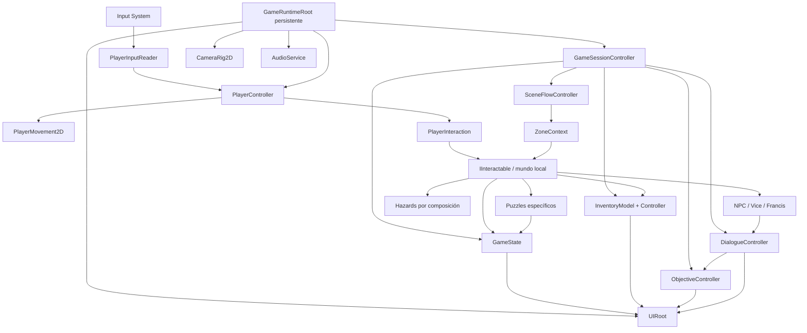
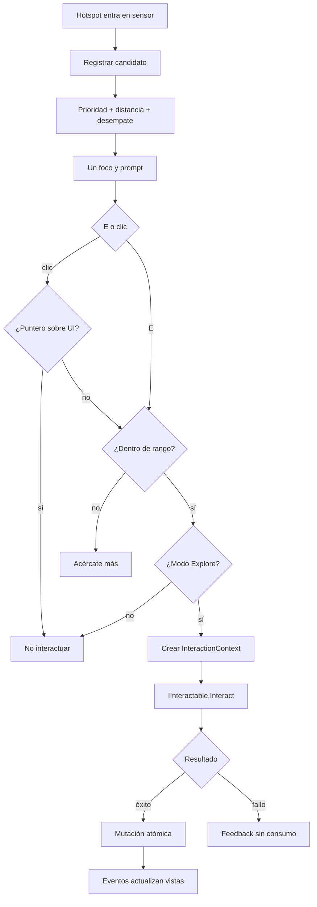
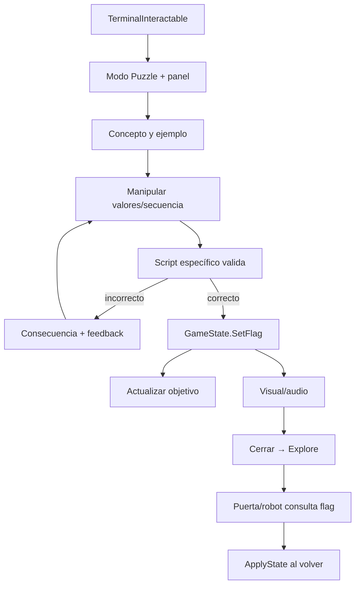
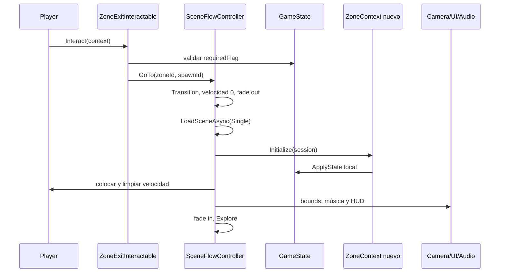
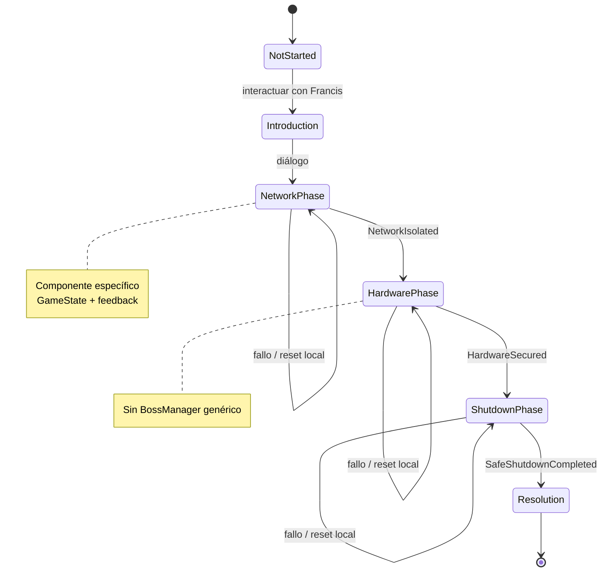
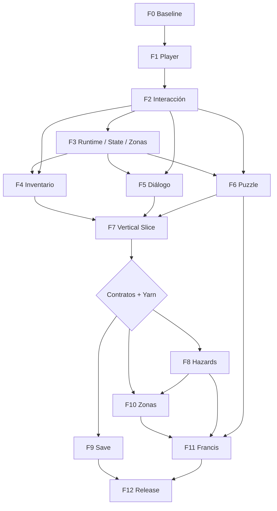

# UNIFRANZ: PROTOCOLO DE ADMISIÓN — arquitectura definitiva y plan de implementación

**Fecha de corte:** 2026-08-16 16:20 (America/La_Paz)  
**Proyecto:** `C:\Users\Usuario\EscapeUNIFRANZ`  
**Motor objetivo:** Unity `6000.3.16f1`, Universal 2D / URP 2D, C#, Input System `1.19.0`  
**Documento previo:** `reports/codex/2026-08-16_1340_analisis_inicial_arquitectura.md`  
**Alcance:** diseño técnico y planificación. No se implementaron scripts, escenas, prefabs, assets, paquetes, Input Actions ni ajustes del proyecto.

> **Decisión corta:** el proyecto sigue siendo viable, pero ya no debe tratarse como un point & click pequeño. Se recomienda una arquitectura propia y acotada, `Rigidbody2D` dinámico para el jugador, interacción por proximidad, `GameState` central, puzzles específicos compuestos con piezas pequeñas y **una escena por zona cargada en modo Single**, con un runtime mínimo persistente. El proyecto completo es 8/10 para estudiantes nuevos; el Vertical Slice Hall + ARCA es el filtro obligatorio antes de autorizar el resto del campus.

---

## 1. Resumen ejecutivo

La nueva propuesta es una aventura gráfica 2D híbrida con movimiento en cuatro direcciones, interacción contextual, inventario, NPC, terminales, hazards móviles y una confrontación final basada en puzzles. Técnicamente es coherente con Unity `6000.3.16f1`, URP 2D y el Input System ya presentes. El cambio aumenta sobre todo la dificultad de **integración**, no la complejidad de una clase aislada.

La arquitectura conserva del análisis anterior:

- `GameState` como fuente central de progreso;
- modelos C# simples para inventario y estado;
- `ScriptableObject` solo para definiciones inmutables;
- una interfaz `IInteractable` pequeña;
- diálogos propios lineales para comenzar;
- puzzles específicos, sin `PuzzleManager` universal;
- eventos C# para notificar cambios y referencias explícitas para ejecutar comandos.

Las decisiones que cambian son:

- se agrega un Player físico y persistente, dividido por responsabilidades;
- la interacción deja de ser raycast remoto y pasa a estar limitada por proximidad;
- una sola escena de gameplay deja de ser la opción preferida;
- aparecen `SceneFlowController`, `ZoneContext`, `GameplayModeController`, objetivo actual, cámara con bounds y piezas reutilizables para hazards;
- el corte vertical debe probar un peligro móvil y el ciclo educativo, no solo item + puerta.

### Veredicto

| Pregunta | Decisión |
|---|---|
| ¿Arquitectura propia o toolkit? | Propia, pequeña y orientada al juego concreto. |
| ¿Movimiento? | `Rigidbody2D` **Dynamic**, gravedad 0, rotación congelada y velocidad controlada en `FixedUpdate`. |
| ¿Escenas? | Bootstrap + **una escena por zona**, cargada en modo `Single`; runtime raíz con `DontDestroyOnLoad`. No carga aditiva. |
| ¿Interacción? | Sensor de proximidad elige foco; E principal; clic alternativo dentro de rango. |
| ¿Puzzles? | Scripts específicos + `GameState` + UI/feedback reutilizable; extraer una base solo tras duplicación real. |
| ¿Diálogo? | Sistema propio lineal durante el Vertical Slice; puerta de decisión Yarn antes del guion completo. |
| ¿MVP? | Entrada, Hall y ARCA en graybox, con conversación, item, inventario, terminal, objetivo, evento IA y build Windows. |
| ¿Vertical Slice? | Hall + ARCA con calidad representativa, retorno, estado reconstruible y un hazard simple. |
| Mayor riesgo | Alcance y dependencia entre contenido, puzzles, arte y estado; no el movimiento básico. |

### Alcance recomendado de la versión universitaria

- 6 zonas obligatorias: Entrada, Hall, ARCA, Segundo piso, Tercer piso y Núcleo IA;
- Zona 3 Cafetería/Game Room/Auditorio como primera zona opcional;
- 20–30 minutos de partida;
- 8–12 items y una combinación item + item como máximo;
- 6 puzzles educativos antes del final;
- boss de Francis con 3 fases explícitas de puzzle;
- 2 tipos de hazard como máximo;
- Vice, Francis y como máximo 1–2 NPC secundarios;
- Windows como entrega principal; Web solo tras estabilizar escritorio.

El contenido completo solo debe autorizarse cuando Hall + ARCA pueda completarse desde un build limpio por una persona ajena, sin instrucciones externas, softlocks ni errores.

---

## 2. Cambios respecto al análisis anterior

| Decisión anterior | Nueva información | Decisión revisada |
|---|---|---|
| Una escena `Gameplay` con rooms activables | 7 zonas, 3 pisos, personaje móvil y varios desarrolladores | Una escena por zona, carga `Single`, runtime persistente pequeño. |
| Interacción por puntero | Movimiento WASD/flechas y proximidad | Foco por trigger; E principal; clic dentro de rango. |
| 3 habitaciones, 4 puzzles | Arco de campus, robots y boss | 6 zonas obligatorias + 1 opcional; 6 puzzles + final. |
| `RoomNavigator` activa roots | Cambios reales de área y trabajo paralelo | `SceneFlowController` carga escenas; `ZoneContext` declara bounds y spawns. |
| Sin navegación física | Personaje se desplaza libremente | Player persistente con física 2D y colliders. |
| Hotspots estáticos | NPC, terminales, hazards y robots | Misma interfaz contextual; componentes por composición. |
| Estado e inventario para HUD | Existe objetivo actual | `ObjectiveController` mínimo, sin quest log RPG. |
| Audio pequeño local | Música/alarmas continúan entre zonas | `AudioService` persistente y simple. |
| Guardado opcional tardío | Partida de 20–30 min | Sigue después del Slice, pero es deseable para versión completa. |
| Dificultad 6/10 | Movimiento, escenas, hazards, boss e historia | 8/10 completo; 6/10 MVP; 7/10 Slice. |

Se conservan estas reglas: SO no guarda estado de sesión; ningún índice de build identifica contenido; UI no decide puzzles; no hay event bus; no se copian repositorios antiguos; no se instala Yarn/toolkit sin necesidad; la apariencia se reconstruye desde estado lógico.

---

## 3. Evaluación de la nueva idea

### Fortalezas

1. La narrativa justifica las mecánicas: hardware, software, lógica y redes pueden ser causas del mundo.
2. La progresión por pisos comunica avance sin quest system complejo.
3. Francis y la IA separan antagonista humano y sistémico sin combate.
4. El movimiento permite exploración, sensores y patrullas sin platforming.
5. El boss puede componer conocimiento ya demostrado.

### Costes añadidos

- locomoción, colisiones, cámara y bounds;
- persistencia del Player entre escenas;
- foco inequívoco con objetos cercanos;
- hazards y reinicio seguro;
- más estados narrativos/visuales;
- integración multi-escena y trabajo concurrente;
- boss con fases restaurables;
- más arte, audio y QA.

### Condiciones de viabilidad

1. Cafetería/Game Room/Auditorio es opcional desde el inicio.
2. Cada robot es puzzle/obstáculo, no enemigo de combate.
3. El arte final comienza después del graybox funcional.
4. El boss tiene tres fases, no una colección de minijuegos.
5. El guion sigue mayormente lineal.
6. El Vertical Slice congela contratos antes de otras zonas.
7. Una persona integra y controla `GameState`, IDs y builds.

La idea deja de ser segura si cada proyecto de Hardware recibe mecánica, UI y comportamiento únicos. Exopiernas, perro, brazos y autos son posibilidades, no compromisos simultáneos.

---

## 4. Alcance técnico recomendado

| Área | Límite recomendado |
|---|---:|
| Zonas obligatorias | 6 |
| Zona opcional | 1 como máximo |
| Duración | 20–30 minutos |
| Items | 8–12 únicos |
| Combinaciones item + item | 0–1 |
| Puzzles educativos previos al final | 6 |
| Pasos máximos de un puzzle normal | 3 |
| Fases del boss | 3 |
| Hazards móviles | 2 tipos |
| NPC | Vice, Francis y 1–2 secundarios |
| Decisiones persistentes | 0–2, sin finales múltiples |
| Guardado | Un slot/checkpoint |
| Plataforma primaria | Windows |
| Plataforma secundaria | Web, condicional |

### Mapa de producción

| Escena | Contenido | Obligatoria |
|---|---|---:|
| `Z00_Entrada` | llegada, presentación e incidente | Sí |
| `Z01_Hall` | tutorial, Vice, objetivo y primer evento IA | Sí |
| `Z02_ARCA` | credencial, terminal y primer puzzle completo | Sí |
| `Z03_Cafeteria` | objeto/lore/hazard adicional | **No** |
| `Z04_SegundoPiso` | hardware, energía/sensor y un hazard | Sí |
| `Z05_TercerPiso` | red/programación, registros y perro/equivalente | Sí |
| `Z06_NucleoIA` | Francis, tres fases y resolución | Sí |

Cada zona obligatoria aporta un propósito narrativo, un concepto principal, un obstáculo central, un cambio de estado y como máximo una mecánica nueva. Lo demás es candidato a corte.

---

## 5. MVP actualizado

El MVP tentativo es correcto si se entiende como **graybox funcional**, no demo visual final.

### Zona 0 — Entrada

- fondo provisional y límites;
- spawn y movimiento;
- incidente breve con pantalla/alarma/bloqueo;
- transición a Hall.

### Zona 1 — Hall

- colisiones y cámara;
- prompt `[E] Interactuar`;
- NPC o comunicación de Vice;
- diálogo lineal;
- objetivo “Encuentra una forma de acceder a ARCA”;
- pickup provisional;
- transición a ARCA.

### Zona 2 — ARCA

- item en inventario y selección/deselección;
- uso sobre acceso;
- terminal de variable/condición;
- flag de resolución;
- estado visual restaurable al volver;
- mensaje de IA;
- fin de MVP.

Incluye Idle/Walk, `flipX`, E/clic en rango, feedback incorrecto, pausa, audio provisional, reinicio limpio y build Windows. No incluye save, Yarn, combinación, robots móviles, Web, boss ni branching.

**Aceptación:** desde ejecutable limpio, una persona recorre Entrada → Hall → ARCA, habla, recoge/usa un item, resuelve la interacción educativa y termina en 4–7 minutos. No atraviesa paredes, no interactúa a distancia, no activa mundo al clicar UI, no hereda estado al reiniciar y no produce errores.

---

## 6. Vertical Slice

El Vertical Slice es **Hall + ARCA con calidad representativa** y una muestra reducida de los riesgos del juego completo.

### Contenido exacto

1. `Bootstrap`, `Z01_Hall` y `Z02_ARCA`.
2. WASD/flechas, diagonal normalizada, collider, facing, Idle/Walk y bloqueo modal.
3. Cámara con seguimiento/bounds en una zona y perfil distinto en la otra.
4. Foco único, prompt, E, clic en rango, feedback fuera de alcance y filtro UI.
5. Vice con conversación presencial/remota y una variante condicionada.
6. Objetivo mostrado, reemplazado y completado.
7. Pickup `credencial_temporal`, selección/deselección y uso; consumo solo al éxito.
8. Un hotspot que rechaza item incorrecto.
9. Terminal de variable + condición con manipulación y feedback causal.
10. Flags de item, acceso y terminal reconstruibles al volver.
11. Mini-auto/dispositivo con patrulla, sensor y desactivación por flag.
12. Evento IA por pantalla/altavoz/alarma, una sola vez.
13. Fade, carga `Single`, spawn por ID y regreso Hall ↔ ARCA.
14. HUD, prompt, inventario, objetivo, mensajes, diálogo, puzzle y pausa.
15. Música, SFX de interacción/UI/alarma/robot.
16. Build Windows 16:9 y prueba 16:10.

No incluye guardado, Yarn, perro, exopiernas, brazos, combinación, boss, Web ni arte de todo el campus.

### Criterios de aceptación

| Código | Criterio |
|---|---|
| VS-01 | Movimiento durante 10 minutos sin atravesar colliders ni drift. |
| VS-02 | Diagonal no es más rápida. |
| VS-03 | Movimiento vertical conserva facing. |
| VS-04 | Diálogo, puzzle, pausa y transición ponen velocidad en cero. |
| VS-05 | Máximo un foco y prompt correcto. |
| VS-06 | E/clic dan mismo resultado; fuera de rango no ejecuta. |
| VS-07 | UI nunca activa un hotspot detrás. |
| VS-08 | Item incorrecto no consume; correcto consume tras éxito. |
| VS-09 | Hall → ARCA → Hall → ARCA restaura todo correctamente. |
| VS-10 | Hazard detecta/resetea y se desactiva sin softlock. |
| VS-11 | Concepto se entiende por acción, sin múltiple choice. |
| VS-12 | Evento IA ocurre una vez y libera controles. |
| VS-13 | Usuario externo completa en 6–10 min sin ayuda verbal. |
| VS-14 | Build Windows inicia desde Bootstrap sin excepciones. |
| VS-15 | Tests verdes para estado, inventario, foco y puzzle. |

Si VS-09 falla no se crea otra zona; si VS-11 falla se rediseña el puzzle; si VS-13 falla se mejora feedback, no se añade un hint system. Solo tras VS-01…15 se congela el núcleo.

---

## 7. Arquitectura general

`Bootstrap.unity` crea un `GameRuntimeRoot` y carga la zona inicial. El root se conserva con `DontDestroyOnLoad`:

```text
GameRuntimeRoot
├── GameSessionController
├── SceneFlowController
├── GameplayModeController
├── PlayerRoot
│   ├── PlayerInputReader
│   ├── PlayerController
│   ├── PlayerMovement2D
│   ├── PlayerInteraction
│   └── PlayerVisualController
├── CameraRig2D
├── UIRoot
└── AudioService
```

`GameSessionController` no implementa todo: posee `GameState`, `InventoryModel` y referencias a controllers concretos.

Cada zona contiene mundo local:

```text
Z02_ARCA
├── ZoneContext
├── Environment
├── WorldCollision
├── SpawnPoints
├── Interactables
├── NPCs
├── Puzzles
├── Hazards
├── CameraBounds
└── LocalAudioEmitters
```

Tras cargar, `SceneFlowController` obtiene exactamente un `ZoneContext`, entrega sesión, aplica estado, coloca Player, configura cámara/música y libera el modo. Buscar el contexto una vez por carga es aceptable; no convertir búsquedas globales en service locator.

### Fronteras

| Sistema | Posee | No posee |
|---|---|---|
| Core | sesión, modo, flujo | reglas de puzzles/sprites/diálogo |
| Player | input, movimiento, foco | inventario, objetivos o escenas |
| Interaction | target y contexto | regla interna del target |
| Inventory | IDs/selección | sprites/puertas |
| Zone | mundo local | progreso global |
| Dialogue | reproducción | verdad de puertas/robots |
| Puzzle | regla propia | catálogo global de puzzles |
| UI | representación | validación de dominio |
| Persistence | DTO/archivo | GameObjects/assets mutables |

Llamadas directas ejecutan comandos; eventos C# notifican cambios de inventario, flag, objetivo y modo. No hay bus global, service locator ni cadena de singletons. Solo el runtime evita duplicados.

---

## 8. Arquitectura del Player

| Componente | Responsabilidad |
|---|---|
| `PlayerInputReader` | Suscribirse a Input Actions y exponer Move/Interact/WorldClick/Cancel |
| `PlayerController` | Coordinar habilitación según `GameplayMode` |
| `PlayerMovement2D` | Normalizar, mover física, detener y exponer facing/moving |
| `PlayerInteraction` | Candidatos, foco, E/clic y prompt |
| `PlayerVisualController` | Animator, `flipX`, Idle/Walk y último facing |
| `InteractionSensor` | Trigger hijo y altas/bajas de candidatos |

El futuro asset tendrá `Gameplay/Move` (Vector2 WASD/flechas), `Interact` (E), `WorldClick` (mouse izquierdo), `Cancel` (Escape/derecho) y `Pointer`, además del map UI. Para un jugador no hace falta `PlayerInputManager`: una clase generada y `PlayerInputReader` bastan. El clic de gameplay se descarta si el EventSystem está sobre UI. Las Input Actions desacoplan conceptos de teclas físicas según la [documentación oficial](https://docs.unity3d.com/Packages/com.unity.inputsystem@1.19/manual/Actions.html).

`GameplayModeController` mantiene un modo exclusivo:

```text
Explore | Dialogue | Puzzle | Transition | Paused | ScriptedSequence
```

Solo `Explore` mueve/interactúa. Pausa recuerda el modo anterior. Entrar en cualquier modo bloqueante pone `linearVelocity` en cero. No hace falta una pila arbitraria de locks.

---

## 9. Movimiento y colisiones

### Elección

| Propiedad | Valor inicial |
|---|---|
| Body Type | `Dynamic` |
| Gravity Scale | `0` |
| Freeze Rotation Z | Sí |
| Linear Damping | `0` o bajo |
| Interpolate | `Interpolate` |
| Collision Detection | `Discrete`; `Continuous` solo si hay tunneling probado |
| Collider | Capsule/Box pequeño alrededor del cuerpo jugable |
| Physics Material | fricción 0 |

`PlayerMovement2D` lee intención en `Update`, normaliza y asigna `Rigidbody2D.linearVelocity = direction * speed` en `FixedUpdate`. No usa Transform, fuerzas, gravedad ni `MovePosition` inicialmente.

Unity documenta que el body dinámico se mueve bajo simulación, colisiona con todos los tipos y no debe reposicionarse por Transform ([Dynamic Rigidbody 2D](https://docs.unity3d.com/6000.0/Documentation/Manual/2d-physics/rigidbody/body-types/dynamic/dynamic-body-type-reference.html)). `linearVelocity` es API vigente ([referencia](https://docs.unity3d.com/6000.0/Documentation/ScriptReference/Rigidbody2D-linearVelocity.html)). Kinematic + `MovePosition` queda para hazards sobre rutas, no para el Player.

Facing: si `abs(x)` supera umbral, actualizar Left/Right; movimiento solo vertical conserva el último facing; `flipX` depende de orientación fuente. Animator inicial: Idle y Walk.

### Mundo

- BoxCollider2D para paredes/props rectos.
- PolygonCollider2D solo para bordes irregulares necesarios.
- TilemapCollider2D + Composite solo si se usan tiles.
- Sin NavMesh/pathfinding.
- Capas separadas para Player, WorldCollision, Interactable, Hazard y Sensor.
- Player no empuja hazards por matriz de colisión.
- `YSortRenderer` solo si una prueba visual demuestra que Sorting Layers fijas no bastan.

---

## 10. Sistema de interacción

```text
IInteractable
├── Prompt
├── Priority
├── IsAvailable(query)
└── Interact(context) → InteractionResult
```

`InteractableBehaviour` proporciona prompt, prioridad y punto de foco comunes. `InteractionContext` incluye item seleccionado, consultas de estado/inventario, comandos explícitos y origen E/mouse. `InteractionResult` distingue `Success`, `Unavailable`, `WrongItem`, `OutOfRange`, `Busy` y `AlreadyResolved`.

### Proximidad y foco

1. Trigger circular hijo detecta capa `Interactable`.
2. Sensor registra entradas/salidas.
3. Resolver elige mayor prioridad, luego menor distancia y finalmente ID estable.
4. Solo el ganador recibe focus/highlight.
5. UI muestra `[E] Hablar`, `[E] Usar terminal`, etc.

No se exige orientación porque el movimiento vertical conserva facing horizontal.

### E y mouse

- E interactúa con foco.
- Clic hace `OverlapPoint`/raycast, pero solo ejecuta si el target está en rango.
- Fuera de rango no mueve al Player; muestra “Acércate más”.
- Clic sobre UI se descarta.
- Item seleccionado viaja en el contexto.
- Escape/derecho deselecciona o cierra modal cancelable.

`PickupInteractable`, `NpcInteractable`, `DoorInteractable`, `InspectInteractable`, terminales específicos y `ZoneExitInteractable` cubren los objetos solicitados. No se crea una clase por sustantivo si solo cambia el dato.

Casos obligatorios: targets solapados, target desactivado con foco, entrada/salida durante modal, item incorrecto, doble pulsación, objeto resuelto, transición duplicada y UI sobre hotspot.

---

## 11. Inventario

`InventoryModel` es una clase C# sin `MonoBehaviour`: capacidad de 8 slots, items únicos por ID, alta/retiro/consulta/selección, operaciones `Try...` atómicas y eventos de cambio. No conoce sprites, GameObjects, audio ni puertas.

`ItemData : ScriptableObject` contiene:

```text
id             string estable, no localizado
displayName    texto visible
description    texto visible
icon           Sprite
consumable     bool
```

`ItemCatalog` valida IDs y resuelve ID → datos. `isOwned`, slot y selección nunca viven en el asset.

- `InventoryController` transforma comandos en mutaciones.
- `InventoryView` reconstruye slots desde el modelo.
- `InventorySlotView` representa icono/selección/clic.
- Clicar el mismo slot deselecciona.
- La selección persiste entre zonas y se limpia al consumir.
- Un pickup desaparece solo si `TryAdd` tuvo éxito.

El flujo item + hotspot es:

```text
selección → intento → hotspot valida → aplica estado → confirma consumo → UI reacciona
```

El item nunca se retira “por si acaso”. La combinación no entra en MVP/Slice. Si se confirma una, `ItemCombinationCatalog` guarda recetas A+B→C con mutación atómica; no se construye crafting general.

---

## 12. GameState

`GameState` sigue siendo adecuado y ahora es imprescindible. Es una clase C# propiedad de la sesión:

```text
GameState
├── schemaVersion
├── currentZoneId
├── currentSpawnId
├── currentObjectiveId
├── checkpointZoneId / checkpointSpawnId
└── completedFlags : HashSet<GameFlagId>
```

Inventario queda separado; `SaveData` reunirá ambos.

Para el tamaño previsto se recomienda `enum GameFlagId` con hechos como:

```text
IncidentStarted
ViceContacted
TemporaryCredentialObtained
ArcaTerminalSolved
SecondFloorAccessGranted
MiniCarsDisabled
ExolegsDisabled
FrancisLogsFound
RobotDogDisconnected
SoftwareLabUnlocked
FrancisBossStarted
NetworkIsolated
HardwareSecured
SafeShutdownCompleted
```

API mínima: `HasFlag`, `SetFlag`, `SetFlags`. Los saves almacenan nombres/IDs estables, no ordinales. Renombrar un ID publicado exige migración.

`ZoneContext` pide a `IStateRestorable` aplicar estado al cargar: pickup oculto, puerta abierta, terminal resuelta, robot apagado y evento visto. El escaneo ocurre una vez. No se guarda apariencia.

### Objetivo actual

Se justifica `ObjectiveController`, no un quest system:

- `ObjectiveData`: ID y texto HUD;
- `ObjectiveCatalog`: resolución/validación;
- `SetCurrent(id)`: actualiza estado y emite evento;
- un solo objetivo principal;
- sin XP, recompensas, subquests, categorías ni historial.

---

## 13. Zonas y escenas

| Alternativa | Ventajas | Riesgos | Veredicto |
|---|---|---|---|
| A. Una grande | referencias fáciles, transición instantánea | conflictos, jerarquía y ownership | Ya no recomendada. |
| B. Una por piso | tres escenas | primer piso concentra cuatro zonas/autores | Segunda opción. |
| C. Una por zona | ownership, carga, debug y Git | más escenas/spawns/build list | **Recomendada.** |
| D. Persistente + aditivas | máxima separación | escena activa, descarga, duplicados, cámaras e init | Innecesaria. |

### Solución

```text
Bootstrap.unity
    crea GameRuntimeRoot persistente
    ↓
LoadSceneAsync(zoneScene, Single)
    ↓
solo una escena de contenido cargada
```

Unity indica que `LoadSceneAsync` carga en segundo plano y que `Single` descarga escenas actuales; `DontDestroyOnLoad` conserva un root y sus hijos ([LoadSceneAsync](https://docs.unity3d.com/6000.0/Documentation/ScriptReference/SceneManagement.SceneManager.LoadSceneAsync.html), [DontDestroyOnLoad](https://docs.unity3d.com/6000.0/Documentation/ScriptReference/Object.DontDestroyOnLoad.html)).

`ZoneExitInteractable` solicita `targetZoneId`, `targetSpawnId` y flag opcional. `SceneFlowController` resuelve el ID en `ZoneCatalog`, entra en Transition, detiene Player, hace fade, carga, inicializa, coloca Player/cámara, cambia música y abre fade.

No usar índices de Build Settings. El catálogo valida escena incluida. Una escena por zona permite ownership exclusivo. Los prefabs compartidos solo los modifica el responsable del sistema.

Solo subdividir una zona si tarda en cargar/editar, requiere ownership simultáneo sostenido, contiene dos áreas naturalmente separadas o ya funciona como dos espacios de cámara.

---

## 14. Cámara

`CameraRig2D` persiste y recibe de `ZoneContext` un perfil:

```text
mode: Fixed | FollowBounded
fixedPosition
orthographicSize
bounds
followDamping
```

- Fixed para pantallas pequeñas.
- FollowBounded sigue y clampa al fondo.
- Cambio cubierto por fade.
- Secuencias específicas pueden tomar control brevemente.

No instalar Cinemachine inicialmente. No está como dependencia directa y un follow ortográfico con clamp es pequeño. Reconsiderarlo solo si se confirman blends, shake, múltiples targets y confiners complejos.

Referencia 1920×1080 16:9; UI `Scale With Screen Size`; margen para 16:10. Probar 1920×1080, 1280×720, 960×600 y ultrawide al terminar cada zona.

---

## 15. NPC y diálogos

### Sistema propio inicial

```text
DialogueSequenceData
└── DialogueLine[]
    ├── speakerId
    ├── text
    ├── portrait opcional
    └── presentation cue opcional

DialogueController
├── Play / Advance / CompleteLine
├── bloquea GameplayMode
└── aplica outcome al terminar

DialogueView
└── speaker, texto, retrato, continuar
```

`NpcDialogueController` tiene una lista corta y ordenada `requiredFlags[] → sequence`; escoge la primera válida. No interpreta expresiones.

`ConversationOutcome` se limita a flags, pocos items, objetivo y una secuencia local explícita. No contiene UnityEvents arbitrarios, referencias cross-scene ni comandos string.

Vice usa la misma infraestructura: `NpcInteractable` presencial o `RemoteDialogueTrigger`; variantes por flags; diálogo breve antes/después de la acción. No se inventa personalidad/historia.

### Puerta Yarn

Se usa sistema propio hasta aprobar el Slice. Inmediatamente después y antes del guion de Segundo/Tercer piso se decide Yarn.

Adoptarlo solo si hay más de 150–200 líneas validadas con cuello de botella, tres ramas persistentes, muchas combinaciones de flags o necesidad real de edición fuera de Inspector. Yarn reemplazaría el backend; `GameState`, inventario y objetivos siguen siendo autoridad C# mediante un puente pequeño.

---

## 16. IA antagonista

La IA es entidad narrativa, no agente general. No crear `AIManager` ni `AISequenceController` global.

Cada manifestación es una secuencia local explícita: `EntranceIncidentSequence`, `ArcaAIManifestation`, `LabLockdownSequence`. Puede coordinar diálogo/mensaje, audio, Animator de pantalla/luz, `StateDrivenActivator` y un flag “visto”.

Si tres eventos repiten pantalla se extrae `AIScreenPresenter` como vista. No se crea un lenguaje de secuencias. Timeline solo podría evaluarse para presentación visual compleja, nunca como verdad lógica.

La IA solicita cambios mediante scripts específicos; no posee estado paralelo. Puertas y robots consultan `GameState` y los eventos no se repiten si su flag existe.

---

## 17. Francis y boss final

Solo existe un boss: no crear `BossManager`, catálogo ni editor de fases.

`FrancisBossController` coordina diálogo, modo, referencias explícitas a tres pasos, visuales, avance, restauración y victoria.

```text
NotStarted
Introduction
PhaseNetwork
PhaseHardware
PhaseShutdown
Resolved
```

El enum ayuda a presentar; hitos persistentes se derivan de `NetworkIsolated`, `HardwareSecured` y `SafeShutdownCompleted`.

No se fija la solución exacta. Cada paso específico expone UI/objetos, valida, da feedback, establece flag, notifica al controller y restaura su vista. No crear `IBossStep` ni base antes de dos pasos concretos; el controller puede referenciar clases explícitas.

No hay salud. Un error resetea solo la fase actual, conserva fases previas, explica, libera UI y permite reintento inmediato.

---

## 18. Puzzles educativos

```text
observar
→ explicación breve
→ manipular variable/secuencia/conexión
→ consecuencia inmediata
→ corregir
→ resolver
→ refuerzo de una frase
```

La respuesta no depende de memorizar una definición externa.

### Reutilizable

- `GameState`, objetivos y modos;
- `PuzzleModalController`;
- `PuzzleFeedbackView`;
- `LearningConceptData` y `ConceptPanelView`;
- feedback audiovisual;
- `StateDrivenActivator`.

### Específico

- `CodeTerminalPuzzle`;
- `PowerSequencePuzzle`;
- `RobotSensorPuzzle`;
- `NetworkRoutingPuzzle`;
- pasos del final.

### Flujo

```text
input → script específico valida
├── fallo: feedback, sin mutar
└── éxito: SetFlag → objetivo → visual/audio → cerrar modal
```

Al volver, el flag reconstruye la vista y habilita lo siguiente. El primer puzzle no crea `PuzzleBase`; tras el segundo se extrae solo inicio/completar/restaurar si la duplicación es real.

Cada puzzle requiere ficha: concepto, estado inicial, acciones, regla, feedback, flag, desbloqueo, restauración y fallo sin softlock.

---

## 19. Amenazas / robots

Son composición de movimiento, sensor, respuesta y estado.

| Componente | Función |
|---|---|
| `PatrolPath2D` | waypoints y loop/ping-pong |
| `PatrolMover2D` | mover Rigidbody2D kinematic |
| `DetectionSensor2D` | trigger/cono/línea simple |
| `HazardResetTrigger` | devolver a checkpoint |
| `DisableByFlag` | apagar mover/sensor/animación |
| `CheckpointAnchor` | punto seguro local |

```text
MiniAuto
├── Rigidbody2D Kinematic
├── Collider/Trigger
├── PatrolPath2D
├── PatrolMover2D
├── DetectionSensor2D
└── DisableByFlag(MiniCarsDisabled)
```

El perro reutiliza piezas; solo crea `RobotDogController` si debe coordinar patrulla/alerta/apagado. Brazos usarían un script de secuencia específico.

Sin health, loot, combate, behavior tree, NavMesh o persecución cross-zone. Un fallo reposiciona localmente; siempre existe ruta segura.

---

## 20. UI

```text
UIRoot (Screen Space Overlay)
├── HUD
│   ├── ObjectiveView
│   ├── InteractionPromptView
│   ├── InventoryView
│   └── MessageToastView
├── DialogueView
├── PuzzleModalController
│   ├── ConceptPanelView
│   ├── PuzzleContentRoot
│   └── PuzzleFeedbackView
├── FadeView
└── PauseMenuController
```

No hay `UIManager`. Cada vista responde a su modelo/controller y `GameplayMode` garantiza exclusividad.

- HUD en Explore;
- prompt oculto en modales/transición;
- inventario solo captura sus rects;
- modal bloquea raycasts al mundo;
- objetivo de una o dos líneas;
- mensajes breves no mutan estado;
- Puzzle UI presenta, no valida;
- pausa mínima.

Accesibilidad: contraste/tamaño legible, feedback no solo por color, completar typewriter, subtítulos y sin timing fino obligatorio.

---

## 21. Audio

`AudioService` persistente y pequeño:

- `MusicSource`: música/crossfade simple;
- `SfxSource`: one-shots;
- `UISource`: UI/diálogo;
- emitters locales para robots cuando aporten valor.

Un AudioMixer básico separa Master/Music/SFX/UI. `ZoneContext` declara música. Los componentes pueden tener clips locales; no hace falta catálogo global.

La alarma debe detenerse por estado; no se duplican fuentes al cargar; audio no contiene reglas; voz IA tiene texto; sin pooling, snapshots complejos ni playlists.

---

## 22. Persistencia

No entra en MVP/Slice. Se agrega cuando la ida/vuelta ya reconstruye estado.

```text
SaveData
├── schemaVersion
├── currentZoneId / currentSpawnId
├── checkpointZoneId / checkpointSpawnId
├── currentObjectiveId
├── completedFlagIds[]
└── inventoryItemIds[]
```

La selección puede limpiarse al cargar.

`SaveService` convierte a DTO, serializa JSON, escribe temporal/reemplaza, valida versión/IDs y devuelve error controlado. No conoce escenas ni GameObjects. Un slot con autosave en transición/checkpoint basta; nunca guardar durante Puzzle/ScriptedSequence.

Reconstrucción: Bootstrap crea modelos → carga save → carga zona/spawn → `ZoneContext` aplica flags → UI reconstruye. Windows es referencia; Web requiere prueba separada.

---

## 23. Estructura de carpetas

```text
Assets/_Project/
├── Art/
│   ├── Characters/
│   ├── Environments/
│   ├── Props/
│   └── UI/
├── Audio/
│   ├── Music/
│   └── SFX/
├── Data/
│   ├── Dialogues/
│   ├── Items/
│   ├── Learning/
│   ├── Objectives/
│   └── Zones/
├── Prefabs/
│   ├── Characters/
│   ├── Hazards/
│   ├── Interactables/
│   ├── Runtime/
│   ├── UI/
│   └── World/
├── Scenes/
│   ├── Bootstrap/
│   └── Zones/
├── Scripts/
│   ├── Audio/
│   ├── Core/
│   ├── Dialogue/
│   ├── Hazards/
│   ├── Input/
│   ├── Interaction/
│   ├── Inventory/
│   ├── Persistence/
│   ├── Player/
│   ├── Puzzles/
│   ├── UI/
│   └── World/
├── UI/
│   ├── Fonts/
│   └── Sprites/
└── Tests/
    ├── EditMode/
    └── PlayMode/
```

Editor/validadores van en `Scripts/Editor` cuando existan. No crear carpeta por clase, por zona dentro de scripts ni assembly por sistema. Inicialmente basta runtime + tests.

Convenciones: escenas `Z##_Nombre.unity`; IDs estables no localizados; clases PascalCase y una clase pública principal por archivo.

---

## 24. Lista inicial de clases

Las clases “condicionales” no deben crearse antes de su fase.

| Clase | Tipo | Responsabilidad | Fase |
|---|---|---|---:|
| `GameSessionController` | MonoBehaviour | Poseer modelos/referencias del runtime e iniciar sesión | 3 |
| `GameState` | C# | Flags, zona, spawn, objetivo y checkpoint | 3 |
| `GameFlagId` | enum | IDs tipados de hechos persistentes | 3 |
| `GameplayModeController` | C# / MB fino | Modo Explore/Dialogue/Puzzle/Transition/Pause | 3 |
| `SceneFlowController` | MonoBehaviour | Fade, carga Single, init y spawn | 3 |
| `ZoneCatalog` | ScriptableObject | ID de zona → escena; validación | 3 |
| `ZoneDefinitionData` | datos | ID, escena y metadatos mínimos | 3 |
| `ZoneContext` | MonoBehaviour | Entrada e inicialización de escena local | 3 |
| `SpawnPoint` | MonoBehaviour | ID y pose de entrada | 3 |
| `IStateRestorable` | interfaz | Aplicar estado a vista local | 3 |
| `PlayerInputReader` | MonoBehaviour | Adaptar Input Actions | 1 |
| `PlayerController` | MonoBehaviour | Coordinar habilitación del Player | 1/3 |
| `PlayerMovement2D` | MonoBehaviour | Velocidad, normalización, stop y facing | 1 |
| `PlayerVisualController` | MonoBehaviour | Animator y `flipX` | 1 |
| `PlayerInteraction` | MonoBehaviour | Foco, E/clic y contexto | 2 |
| `InteractionSensor` | MonoBehaviour | Candidatos por trigger | 2 |
| `InteractionCandidateResolver` | C# | Elegir target determinista | 2 |
| `IInteractable` | interfaz | Contrato de interacción | 2 |
| `InteractableBehaviour` | MB abstracto | Prompt, prioridad y punto comunes | 2 |
| `InteractionContext` | readonly struct/clase | Item/servicios/origen | 2/4 |
| `InteractionResult` | enum/struct | Resultado lógico | 2 |
| `InspectInteractable` | MonoBehaviour | Mostrar observación | 2 |
| `PickupInteractable` | MonoBehaviour | Añadir item y marcar pickup | 4 |
| `DoorInteractable` | MonoBehaviour | Validar item/flag y abrir | 4 |
| `ZoneExitInteractable` | MonoBehaviour | Solicitar transición | 3 |
| `NpcInteractable` | MonoBehaviour | Iniciar conversación | 5 |
| `InventoryModel` | C# | Items, selección y atomicidad | 4 |
| `InventoryController` | C# / MB fino | Comandos modelo/mundo | 4 |
| `ItemData` | ScriptableObject | Definición inmutable | 4 |
| `ItemCatalog` | ScriptableObject | Resolver/validar items | 4 |
| `InventoryView` | MonoBehaviour | Renderizar slots | 4 |
| `InventorySlotView` | MonoBehaviour | Icono, selección y clic | 4 |
| `ItemCombinationCatalog` | ScriptableObject | Pocas recetas; condicional | 10+ |
| `ObjectiveController` | C# / MB fino | Un objetivo actual | 3 |
| `ObjectiveData` | ScriptableObject | ID/texto | 3 |
| `ObjectiveCatalog` | ScriptableObject | Resolver/validar objetivos | 3 |
| `DialogueSequenceData` | ScriptableObject | Líneas de conversación | 5 |
| `DialogueController` | MonoBehaviour | Ejecutar secuencia y modo | 5 |
| `DialogueView` | MonoBehaviour | Presentación/typewriter | 5 |
| `NpcDialogueController` | MonoBehaviour | Elegir variante por flags | 5 |
| `ConversationOutcome` | datos | Flags/items/objetivo final | 5 |
| `RemoteDialogueTrigger` | MonoBehaviour | Comunicación de Vice | 5 |
| `PuzzleModalController` | MonoBehaviour | Modal y bloqueo | 6 |
| `PuzzleFeedbackView` | MonoBehaviour | Feedback de intento | 6 |
| `LearningConceptData` | ScriptableObject | Explicación/refuerzo | 6 |
| `ConceptPanelView` | MonoBehaviour | Mostrar concepto | 6 |
| `CodeTerminalPuzzle` | MonoBehaviour | Primera regla específica | 6 |
| `StateDrivenActivator` | MonoBehaviour | Visual según flag | 6 |
| `CameraRig2D` | MonoBehaviour | Cámara fija/follow bounded | 1/3 |
| `CameraZoneProfile` | datos | Modo, tamaño y bounds | 3 |
| `PatrolPath2D` | MonoBehaviour | Waypoints | 8 |
| `PatrolMover2D` | MonoBehaviour | Patrulla kinematic | 8 |
| `DetectionSensor2D` | MonoBehaviour | Detección simple | 8 |
| `HazardResetTrigger` | MonoBehaviour | Reponer en checkpoint | 8 |
| `DisableByFlag` | MonoBehaviour | Desactivar hazard | 8 |
| `RobotDogController` | MonoBehaviour | Coordinar perro; condicional | 10 |
| `AudioService` | MonoBehaviour | Música/SFX/UI persistentes | 7 |
| `HudPresenter` | MonoBehaviour | Conectar HUD | 3/7 |
| `InteractionPromptView` | MonoBehaviour | Prompt de foco | 2 |
| `ObjectiveView` | MonoBehaviour | Objetivo | 3 |
| `MessageToastView` | MonoBehaviour | Feedback breve | 2 |
| `FadeView` | MonoBehaviour | Fade de escena | 3 |
| `PauseMenuController` | MonoBehaviour | Pausa y retorno de modo | 7 |
| `SaveData` | DTO | Formato de guardado | 9 |
| `SaveService` | C# | JSON/validación/archivo | 9 |
| `FrancisBossController` | MonoBehaviour | Boss específico de tres fases | 11 |
| `ProjectContentValidator` | Editor | IDs, zonas, spawns y referencias | 7 |

Clases ausentes deliberadamente: `GameManager`, `PuzzleManager`, `EnemyManager`, `RobotManager`, `UIManager`, `QuestManager`, `BossManager`, `EventBus`, `ServiceLocator` y `AIManager`.

---

## 25. Diagramas de arquitectura

### Arquitectura general



### Flujo de interacción



### Flujo de puzzle



### Cambio de zona



### Boss final técnico



---

## 26. Plan de implementación por fases

Los archivos son previstos, no creados por esta tarea.

### Fase 0 — Baseline, Git y builds vacíos

- **Objetivo:** proyecto recuperable y entorno fijo.
- **Sistemas:** Git, serialización/meta, identidad, plataforma, build.
- **Clases:** ninguna.
- **Archivos previstos:** `.gitignore`, `.gitattributes`, configuración documentada de UnityYAMLMerge y cambios aprobados posteriores en ProjectSettings/build profile.
- **Dependencias:** ninguna.
- **Riesgo:** 🟢 técnico; 🔴 si se omite.
- **Dificultad:** 2/10.
- **Resultado:** repo limpio y build Windows vacío.
- **Aceptación:** clonar en otra carpeta, abrir con `6000.3.16f1`, cero errores y build reproducible.

### Fase 1 — Player, movimiento, visual y cámara

- **Objetivo:** locomoción sólida en graybox.
- **Sistemas:** Input, Rigidbody2D, facing, Animator, cámara.
- **Clases:** `PlayerInputReader`, `PlayerController`, `PlayerMovement2D`, `PlayerVisualController`, `CameraRig2D`.
- **Archivos previstos:** `Scripts/Input/PlayerInputReader.cs`, `Scripts/Player/*.cs`, `Scripts/World/CameraRig2D.cs`, tests.
- **Dependencias:** F0; Input Actions aprobadas/configuradas por equipo.
- **Riesgo:** 🟡 física/wiring.
- **Dificultad:** 4/10.
- **Resultado:** Player recorre Hall graybox.
- **Aceptación:** WASD/flechas, diagonal, facing, stop, límites y cero errores.

### Fase 2 — Interacción de proximidad

- **Objetivo:** target inequívoco por E/mouse.
- **Sistemas:** sensor, resolver, interfaz, prompt, filtro UI.
- **Clases:** `IInteractable`, `InteractableBehaviour`, `InteractionSensor`, `InteractionCandidateResolver`, `PlayerInteraction`, contexto/resultado, `InspectInteractable`, prompt/toast.
- **Archivos previstos:** `Scripts/Interaction/*.cs`, UI prompt y tests resolver.
- **Dependencias:** F1.
- **Riesgo:** 🟡 solapamiento/click-through.
- **Dificultad:** 5/10.
- **Resultado:** hotspots estables.
- **Aceptación:** E/clic equivalentes, rango/UI correctos, target desactivado limpia prompt.

### Fase 3 — Runtime, estado, objetivos y zonas

- **Objetivo:** sesión persistente y transición entre dos escenas.
- **Sistemas:** runtime, modos, estado, objetivo, zonas, fade, spawn, cámara.
- **Clases:** session/state/flags/mode/flow/catalog/context/spawn/restorable/exit/objective/fade.
- **Archivos previstos:** `Scripts/Core/*.cs`, `Scripts/World/Zone*.cs`, Objective UI y datos de dos zonas.
- **Dependencias:** F1–F2.
- **Riesgo:** 🔴 init/duplicados.
- **Dificultad:** 6/10.
- **Resultado:** Bootstrap → Hall ↔ ARCA conserva flag/objetivo.
- **Aceptación:** un runtime/EventSystem/Player, spawn/bounds correctos y sin referencias perdidas.

### Fase 4 — Inventario, pickup e item + hotspot

- **Objetivo:** recoger–seleccionar–usar.
- **Sistemas:** modelo, catálogo, vista, pickup y acceso.
- **Clases:** inventario, items, views, pickup y door.
- **Archivos previstos:** `Scripts/Inventory/*.cs`, interactables, data/prefab y tests.
- **Dependencias:** F2–F3.
- **Riesgo:** 🟡 consumo/duplicación.
- **Dificultad:** 6/10.
- **Resultado:** credencial usada sobre acceso.
- **Aceptación:** alta/consumo atómicos, no duplicado y vista=modelo.

### Fase 5 — NPC, Vice y diálogo

- **Objetivo:** conversación presencial/remota condicionada.
- **Sistemas:** datos, controller, view, variantes/outcomes.
- **Clases:** data/controller/view/NPC/outcome/remote trigger.
- **Archivos previstos:** `Scripts/Dialogue/*.cs`, UI, asset y tests de variante.
- **Dependencias:** F2–F3; paralela a F4.
- **Riesgo:** 🟡 bloqueo/outcomes.
- **Dificultad:** 5/10.
- **Resultado:** Vice habla, cambia objetivo y reacciona a flag.
- **Aceptación:** typewriter/avance, outcome único y siempre libera modo.

### Fase 6 — Primer puzzle educativo

- **Objetivo:** aprendizaje por manipulación.
- **Sistemas:** modal, concepto, feedback, terminal/restauración.
- **Clases:** puzzle modal/feedback/learning data/concept view/code terminal/state activator.
- **Archivos previstos:** `Scripts/Puzzles/*.cs`, UI/data y tests de regla.
- **Dependencias:** F2–F3; integra F4 si procede.
- **Riesgo:** 🔴 diseño educativo, 🟡 técnico.
- **Dificultad:** 7/10.
- **Resultado:** terminal enseña variable/condición y abre acceso.
- **Aceptación:** causa/efecto, errores informativos, sin test A/B/C/D, flag/restauración.

### Fase 7 — Vertical Slice

- **Objetivo:** Hall + ARCA representativos y build.
- **Sistemas:** anteriores, UI, audio, pausa, evento IA, validador.
- **Clases:** `AudioService`, `HudPresenter`, `PauseMenuController`, `ArcaAIManifestation`, `ProjectContentValidator`.
- **Archivos previstos:** runtime prefab, escenas, UI, audio y scripts Audio/UI/Editor.
- **Dependencias:** F3–F6.
- **Riesgo:** 🔴 integración.
- **Dificultad:** 8/10.
- **Resultado:** Slice de 6–10 minutos.
- **Aceptación:** VS-01…VS-15 y playtest externo.

### Puerta — Yarn y contratos

Tras F7: medir diálogo, decidir Yarn, congelar APIs e impedir más escenas hasta aprobación.

### Fase 8 — Hazard reutilizable

- **Objetivo:** piezas de robots.
- **Sistemas:** patrulla, sensor, checkpoint y desactivación.
- **Clases:** path/mover/sensor/reset/checkpoint/disable.
- **Archivos previstos:** `Scripts/Hazards/*.cs`, prefab MiniAuto y tests.
- **Dependencias:** F7.
- **Riesgo:** 🟡 timing/colliders.
- **Dificultad:** 6/10.
- **Resultado:** hazard reutilizado en dos rutas.
- **Aceptación:** patrón determinista, reset seguro, pausa y flag correctos.

### Fase 9 — Persistencia de un slot

- **Objetivo:** continuar entre sesiones.
- **Sistemas:** DTO/JSON/validación/checkpoint.
- **Clases:** `SaveData`, `SaveService`.
- **Archivos previstos:** `Scripts/Persistence/*.cs` y tests.
- **Dependencias:** F3/F7; paralela a F8.
- **Riesgo:** 🟡 Windows, 🔴 si se mezcla Web.
- **Dificultad:** 6/10.
- **Resultado:** cerrar/reabrir y continuar.
- **Aceptación:** válido restaura; corrupto permite nueva partida; no guarda modal inseguro.

### Fase 10 — Zonas y puzzles restantes

- **Objetivo:** Entrada, Segundo y Tercer piso.
- **Sistemas:** contenido, puzzles, Vice/IA, objetivos y hazards.
- **Clases:** secuencia incidente, puzzles power/sensor/network y RobotDog condicional.
- **Archivos previstos:** escenas, scripts específicos, datos, prefabs, tests.
- **Dependencias:** F7; F8 para hazards.
- **Riesgo:** 🔴 contenido/arte/integración.
- **Dificultad:** 8/10.
- **Resultado:** recorrido hasta laboratorio.
- **Aceptación:** ficha/playtest/restauración por zona y ninguna mecánica fuera de contrato.

### Fase 11 — Francis y final

- **Objetivo:** boss de tres fases y resolución.
- **Sistemas:** diálogo, fases, puzzles, feedback y estado.
- **Clases:** `FrancisBossController` + tres componentes concretos aprobados.
- **Archivos previstos:** scripts Francis, escena Núcleo y assets/tests del final.
- **Dependencias:** F6/F8/F10.
- **Riesgo:** 🔴 multidominio.
- **Dificultad:** 9/10.
- **Resultado:** final completo/reintentable/restaurable.
- **Aceptación:** tres fases, reset local, sin combate/softlock y mensaje integrador.

### Fase 12 — Pulido, QA y release

- **Objetivo:** estabilizar sin features nuevas.
- **Sistemas:** feedback, audio, UX, accesibilidad, builds.
- **Clases:** correcciones/validadores; arquitectura nueva prohibida.
- **Archivos previstos:** ajustes aprobados, checklist, créditos/licencias y builds.
- **Dependencias:** F10–F11.
- **Riesgo:** 🔴 si crece scope.
- **Dificultad:** 7/10.
- **Resultado:** release candidate Windows; Web condicional.
- **Aceptación:** tres playthroughs externos, cero errores, validación y backup.

---

## 27. Dependencias entre fases



Ruta crítica: `F0 → F1 → F2 → F3 → F6 → F7 → Gate → F8 → F10 → F11 → F12`. F4, F5 y F6 pueden ir en paralelo tras F3 si trabajan en archivos distintos y un integrador controla contratos.

---

## 28. Trabajo paralelo posible

### Antes del Slice

| Frente | Puede avanzar | No debe tocar |
|---|---|---|
| Player/Interaction | scripts/tests | escenas finales/arte |
| Hall/ARCA | graybox/layout/colliders | runtime compartido sin coordinación |
| UI | wireframes/prefabs aislados | reglas de dominio |
| Narrativa | guion corto/flags/outcomes | diálogo masivo antes de Yarn gate |
| Puzzle | ficha/prototipo/regla pura | editor/lenguaje genérico |
| Arte | escala/siluetas/style guide | siete fondos finales |
| Audio | cues/clips provisionales | sistema paralelo |

Después: un autor por escena; un responsable de sistemas compartidos; hazards/save en ramas separadas; boss solo tras documento de tres pasos.

Archivos de alta contención con ownership temporal: Input Actions, runtime prefab, HUD, catálogos, `GameFlagId`, build settings/profile y cada `.unity`.

---

## 29. División Nosotros / Codex

### Codex

- scripts runtime;
- modelos C# y DTO;
- tests EditMode/PlayMode;
- validadores de IDs/referencias;
- refactoring después de duplicación comprobada;
- debugging de logs/builds;
- documentación de APIs;
- checklist de componentes e Inspector;
- revisión de diffs de escenas/prefabs sin reescribirlos;
- automatización de builds cuando se autorice.

### Nosotros

- historia, diálogos y tono;
- puzzles narrativos;
- graybox y composición de zonas;
- GameObjects, colliders y spawns;
- sprites, fondos, props, iconos y animaciones;
- Animator Controller y clips;
- audio y mezcla creativa;
- configuración Inspector/referencias;
- pruebas de claridad/ritmo;
- aceptación de commits y alcance.

### Compartido

- contrato de features;
- IDs y flags;
- aceptación;
- integración prefab/escena;
- reproducción de bugs;
- playtests/priorización.

Codex no debe editar `.unity` ni `.prefab` por defecto. Si una corrección lo exige: autorización expresa, ownership, rama aislada y revisión YAML/visual.

---

## 30. Flujo de trabajo con Codex

```text
1. Nosotros definimos comportamiento observable
   ↓
2. Acordamos input, output, estado, errores y aceptación
   ↓
3. Codex inspecciona contratos y propone archivos
   ↓
4. Codex implementa scripts + tests sin escenas
   ↓
5. Codex entrega checklist Inspector/jerarquía
   ↓
6. Nosotros montamos prefab/escena y arte/colliders
   ↓
7. Probamos Editor/build y entregamos pasos/log
   ↓
8. Codex reproduce, corrige y retesta
   ↓
9. Verificamos visualmente y aprobamos
   ↓
10. Commit pequeño con resultado DONE
```

Plantilla de feature:

```text
Objetivo observable:
Escena/prefab:
Input:
Resultado esperado:
Estado leído/escrito:
Casos de error:
Archivos permitidos/prohibidos:
Criterio de aceptación:
```

Reglas: una feature por tarea; no mezclar refactor/contenido; declarar archivos no previstos; coordinar Unity/import; no aceptar solo Editor en hitos; no seguir con consola roja.

---

## 31. Estrategia Git

No ejecutar todavía.

### Versionar

- `Assets/**`, incluyendo todos los `.meta`;
- `Packages/manifest.json` y `packages-lock.json`;
- `ProjectSettings/**`;
- `.gitignore`, `.gitattributes` y documentación;
- `reports/codex/` si el equipo decide conservar informes;
- fuentes de arte/audio necesarias; Git LFS para binarios grandes.

### Ignorar

- `Library/`, `Temp/`, `Obj/`, `Logs/`, `UserSettings/`;
- `MemoryCaptures/`, `Recordings/`;
- `Build/`, `Builds/`;
- `.vs/`, `*.csproj`, `*.sln`, caches;
- dumps y temporales.

Unity recomienda meta files visibles para versionar recursos con metadatos; Smart Merge/YAMLMerge ayuda con serializados ([Version Control](https://docs.unity3d.com/6000.0/Documentation/Manual/class-VersionControlSettings.html), [Smart Merge](https://docs.unity3d.com/6000.0/Documentation/Manual/SmartMerge.html)). Antes del primer commit confirmar `Visible Meta Files` y `Force Text`.

### LFS

Usar para PSD/PSB grandes, audio sin compresión, video y binarios pesados. No meter todo Assets: `.unity`, `.prefab`, `.asset`, `.meta`, C# y JSON deben seguir en texto.

### Ramas

```text
main                    siempre jugable
feature/player-movement corta
feature/inventory       corta
zone/arca               ownership de escena
fix/interaction-focus   corta
```

No mantener `develop` larga. Actualizar desde main y fusionar solo con aceptación/tests.

### Commits

- al completar unidad verificable;
- separar código/tests de montaje masivo cuando ayude;
- nunca con compilación rota;
- mensajes orientados a resultado;
- tag/commit para MVP, Slice y release candidate.

### Evitar conflictos de escena

1. Un dueño por escena durante una tarea.
2. Una escena por zona.
3. Sistemas compartidos como prefabs, no copias.
4. Coordinar runtime, Input Actions y catálogos.
5. Evitar reordenamientos masivos.
6. UnityYAMLMerge ayuda; siempre revisar en Editor.
7. Integrar un cambio primero si dos tocan la escena.
8. Revisar visualmente tras resolver conflictos.

---

## 32. Tests

### EditMode

| Sistema | Casos |
|---|---|
| Movimiento | normalización, vector cero, facing y conservación vertical |
| Foco | prioridad, distancia, empate, target removido |
| Inventario | alta, capacidad, duplicado, retiro, selección, atomicidad |
| Items | IDs únicos, catálogo y referencias |
| GameState | Has/Set, idempotencia, objetivo y reset |
| Puzzle | válido/inválido, no mutación en fallo, flag en éxito |
| Diálogo | variante por flags y outcome único |
| Zonas | IDs/escenas/spawns no duplicados |
| Combinación | si existe: orden, ausencia, capacidad, consumo |
| Save | round-trip, versión, ID desconocido y JSON corrupto |

### PlayMode

- Rigidbody se detiene al bloquear;
- Player no atraviesa pared simple;
- sensor añade/quita candidato;
- clic UI no interactúa con mundo;
- pickup exitoso oculta; inventario lleno no;
- un runtime/EventSystem tras cargas;
- zona coloca spawn/aplica estado;
- diálogo/puzzle liberan modo;
- hazard vuelve a checkpoint y se desactiva;
- puerta abierta persiste al regresar.

### Manual

- velocidad/collider/esquinas;
- Animator/flip/sorting;
- claridad de foco y aprendizaje;
- ritmo de diálogo;
- audio/alarmas;
- 16:9/16:10;
- transiciones;
- playthrough/rutas de error;
- narrativa Francis/IA;
- build Windows y Web si entra.

No automatizar comprensión del puzzle, arte, balance de audio ni ritmo: requieren usuarios.

---

## 33. Definition of Done

### Movimiento DONE cuando

- WASD/flechas y diagonal normalizada;
- no atraviesa límites ni se pega en esquinas;
- facing/Idle/Walk/flip correctos;
- todo bloqueo deja velocidad cero;
- tests/consola verdes.

### Interacción DONE cuando

- hay 0 o 1 foco y prompt coincide;
- E/clic en rango equivalentes;
- fuera de rango/ocupado dan feedback;
- UI nunca activa mundo;
- target desactivado limpia foco;
- solapamientos probados.

### Inventario DONE cuando

- recoger/mostrar/seleccionar/deseleccionar;
- lleno no destruye pickup;
- incorrecto no consume;
- correcto consume tras éxito;
- retorno no duplica;
- modelo=vista y tests verdes.

### Estado/objetivo DONE cuando

- flags solo en `GameState` y nombres de hechos;
- reinicio vacío;
- objetivo cambia por un controller;
- vistas se reconstruyen;
- no hay bools de progreso ocultos.

### Zona/escena DONE cuando

- parte de Bootstrap;
- un ZoneContext y spawns válidos;
- fade/modo bloquean;
- no duplica Player/UI/audio;
- ida/vuelta conserva estado;
- está en catálogo/build y abre en otro equipo.

### Diálogo/NPC DONE cuando

- líneas son datos;
- variante por estado;
- typewriter completable;
- gameplay bloqueado;
- outcome una vez;
- todo cierre libera modo;
- texto revisado.

### Puzzle educativo DONE cuando

- ficha aprobada;
- manipulación + consecuencia;
- fallo informa sin destruir progreso;
- éxito establece un hecho;
- vista se restaura;
- desbloqueo usa estado lógico;
- usuario externo lo entiende sin examen/ayuda.

### Hazard DONE cuando

- patrón predecible;
- sensor coherente;
- checkpoint/ruta segura;
- fallo local;
- pausa/transición detienen;
- flag desactiva/restaura;
- no softlock.

### UI DONE cuando

- 16:9/16:10 legibles;
- modales bloquean mundo;
- HUD refleja modelos;
- feedback no solo color;
- texto no se corta;
- no warnings.

### Audio DONE cuando

- música cambia sin duplicar;
- SFX coherentes;
- alarma se detiene;
- pausa/volumen consistentes;
- voz IA subtitulada;
- no faltan clips.

### Persistencia DONE cuando

- round-trip pasa;
- corrupción permite nueva partida;
- IDs desconocidos se manejan;
- zona/inventario/objetivo/vistas se restauran;
- no guarda estado inseguro;
- formato documentado.

### Boss DONE cuando

- tres fases con propósito/feedback;
- fallo reinicia fase local;
- progreso reconstruible;
- sin combate;
- reutiliza conceptos;
- mensaje integrador;
- playtest sin softlock.

### Build/release DONE cuando

- ejecutable limpio abre;
- partida completa sin errores;
- tres playthroughs externos consecutivos;
- créditos/licencias correctos;
- backup/tag;
- Windows offline funciona.

---

## 34. Riesgos actualizados

| Nivel | Riesgo | Consecuencia | Mitigación |
|---|---|---|---|
| 🔴 | 7 zonas + boss | contenido inconcluso | 6 obligatorias, zona 3 opcional y gates |
| 🔴 | Sin Git | pérdida/conflictos | F0 antes de contenido |
| 🔴 | Estado en escenas | softlocks | GameState/IDs/restauración |
| 🔴 | Arte antes de gameplay | retrabajo | graybox → aceptación → arte |
| 🔴 | Puzzle no se entiende | examen/adivinanza | papel + playtest externo |
| 🔴 | Dependencias items/puzzles | partida imposible | ficha, dependencias, playthrough |
| 🔴 | Boss tardío | cierre débil | fijar 3 fases tras Slice |
| 🔴 | Integración de escenas | YAML/referencias | zona por escena + ownership |
| 🟡 | Runtime duplicado | 2 Player/UI/audio | Bootstrap/guard/tests |
| 🟡 | Proximidad ambigua | target erróneo | resolver/prompt/puntos |
| 🟡 | Física en esquinas | jitter/tunneling | collider/fricción/capas/tests |
| 🟡 | Hazards | falsos positivos/softlock | rutas cortas/checkpoint/reset |
| 🟡 | Robots únicos | sistemas distintos | máximo dos tipos |
| 🟡 | Yarn prematuro | estado doble | gate explícito |
| 🟡 | UI click-through | doble acción | EventSystem/modo/test |
| 🟡 | IDs manuales | refs inválidas | validador pre-build |
| 🟡 | Save temprano | mundo inconsistente | después de retorno Slice |
| 🟡 | Web | AOT/audio/storage | Windows primario |
| 🟡 | Arte/collider | interacción falsa | guía de pivot/escala |
| 🟡 | Aspecto | UI cortada | matriz desde Slice |
| 🟢 | Rendimiento 2D | poco probable | medir antes de optimizar |
| 🟢 | URP/Input actuales | alineados | fijar versiones |
| 🟢 | Sin Cinemachine | código pequeño | añadir solo si se mide necesidad |

La mayor amenaza es terminar demasiado contenido interdependiente antes de estabilizar Hall + ARCA. La combinación tardía de guion, arte, flags, puzzles y escenas destruye calendarios.

---

## 35. Estrategia de recorte de alcance

Orden exacto:

1. Eliminar Zona 3 Cafetería/Game Room/Auditorio.
2. Eliminar combinación item + item no terminada.
3. Posponer Web; conservar Windows.
4. Eliminar save si la partida queda bajo 20 minutos; conservar checkpoints en memoria.
5. Eliminar NPC secundarios; conservar Vice/Francis.
6. Elegir un hazard móvil entre auto/perro.
7. Convertir otro robot en dispositivo estático.
8. Reducir Entrada a secuencia breve.
9. Un puzzle central por Segundo/Tercer piso.
10. Reducir variantes de diálogo.
11. Boss lineal de tres pasos, sin simultaneidad/persecución.
12. Fusionar áreas visuales sin crear sistemas.

Nunca cortar: movimiento, Hall+ARCA, Vice, item/inventario/hotspot, terminal educativa, cambio de zona/estado, evento IA, Francis/final simplificado, mensaje integrador y Windows estable.

No cortar tests, Git, feedback o restauración: reduce calidad sin bajar complejidad real.

---

## 36. Dificultad actualizada

| Sistema | Dificultad | Motivo |
|---|---:|---|
| Player movement | 4/10 | input + física directa |
| Animation/facing | 3/10 | dos estados y flip |
| World collisions | 5/10 | colliders/esquinas/capas |
| Interaction | 6/10 | proximidad, mouse/E, UI |
| Inventory | 6/10 | atomicidad y cross-zone |
| NPC/dialogue propio | 5/10 | lineal/variantes limitadas |
| Yarn | 7/10 | paquete/lenguaje/puente |
| Educational puzzles | 8/10 | pedagogía + técnica |
| Moving hazards | 7/10 | timing/sensor/reset |
| Robot dog | 8/10 | patrulla/alerta/estado |
| Francis boss | 9/10 | integración multidominio |
| Scene/zone | 6/10 | runtime/spawns/restauración |
| State/objectives | 6/10 | IDs/eventos/consistencia |
| UI | 6/10 | modales/raycasts/escalado |
| Audio | 4/10 | servicio simple/mezcla |
| Save | 6/10 | esquema/IDs/reconstrucción |
| Integration | 9/10 | mayor fuente de retrabajo |

Global: concepto sin recortes 9/10; versión acotada 8/10; Vertical Slice 7/10; MVP 6/10. Baja un punto con responsable técnico, Git y playtests; sube a 10 si se intentan todos los robots, Yarn, Web, save y siete zonas a la vez.

---

## 37. Qué NO construir

- Everything/GameManager omnipotente o colección de singletons.
- PuzzleManager universal.
- Enemy/Robot/BossManager o behavior tree.
- editor de nodos/lenguaje visual.
- intérprete genérico de acciones/condiciones.
- IA generativa.
- combate, salud, daño, loot o equipamiento.
- NavMesh/pathfinding sin necesidad.
- controller/animación de 8 direcciones.
- click-to-move.
- inventario RPG/crafting.
- quest log/XP/recompensas.
- editor de diálogo propio.
- Yarn antes del gate.
- Cinemachine por costumbre.
- escenas aditivas/bootstrap complejo.
- Addressables para estas zonas.
- save de GameObjects/Transforms/Animator.
- event bus/service locator global.
- UnityEvents como lógica central.
- wrapper de cada API.
- motor de secuencias propio.
- puzzles de todos los robots antes del Slice.
- arte final de todo el campus antes del graybox.
- Web si arriesga Windows.

---

## 38. Orden exacto de las próximas cinco tareas

### 1. Baseline y repositorio

El equipo crea Git, ignore, metas visibles, texto, LFS y build vacío Windows; confirma clon/apertura. Codex puede revisar, pero no ejecutar sin autorización.

### 2. Contrato de input y Player

El equipo aprueba Move/Interact/WorldClick/Cancel, pivots/escala y velocidad. Codex implementa InputReader, Movement, Visual y tests, sin escena.

### 3. Graybox de movimiento

El equipo monta Player/Hall con colliders/Animator siguiendo checklist. Valida movimiento, facing, esquinas, bounds y cámara 10 minutos.

### 4. Interacción por proximidad

Codex implementa interfaz, sensor, resolver, prompt, filtro UI y tests. El equipo monta tres hotspots y prueba E/clic/rango.

### 5. Runtime, estado y Hall ↔ ARCA

Codex implementa sesión, estado, modos, scene flow, contextos, spawns y objetivo. El equipo crea Bootstrap y dos grayboxes; prueba ida/vuelta antes de inventario.

La primera feature de gameplay para Codex es **locomoción del Player**, después del baseline Git y la aprobación del contrato Input Actions.

---

## 39. Recomendación final

Usaría arquitectura propia y acotada: `GameRuntimeRoot` persistente; modelos `GameState`/`InventoryModel`; Player dividido en input, movimiento, interacción y visual; interfaz contextual; escena por zona cargada en Single; UI como vistas; diálogo lineal propio; puzzles/hazards específicos con pocas piezas reutilizables.

Primero produciría MVP graybox Entrada → Hall → ARCA y después Hall + ARCA como Vertical Slice con un hazard pequeño. Esa sección decide si el juego escala, si Yarn aporta valor y qué robots sobreviven.

La arquitectura no pretende ser un engine. Busca reglas visibles, ownership de zonas, estado reconstruible y código explicable por estudiantes.

### Fuentes técnicas

- [Unity 6000.3.16f1](https://unity.com/releases/editor/whats-new/6000.3.16f1)
- [Dynamic Rigidbody 2D](https://docs.unity3d.com/6000.0/Documentation/Manual/2d-physics/rigidbody/body-types/dynamic/dynamic-body-type-reference.html)
- [Rigidbody2D.linearVelocity](https://docs.unity3d.com/6000.0/Documentation/ScriptReference/Rigidbody2D-linearVelocity.html)
- [Rigidbody2D.MovePosition](https://docs.unity3d.com/6000.0/Documentation/ScriptReference/Rigidbody2D.MovePosition.html)
- [LoadSceneAsync](https://docs.unity3d.com/6000.0/Documentation/ScriptReference/SceneManagement.SceneManager.LoadSceneAsync.html)
- [DontDestroyOnLoad](https://docs.unity3d.com/6000.0/Documentation/ScriptReference/Object.DontDestroyOnLoad.html)
- [Input System 1.19 — Actions](https://docs.unity3d.com/Packages/com.unity.inputsystem@1.19/manual/Actions.html)
- [Input System 1.19 — UI support](https://docs.unity3d.com/Packages/com.unity.inputsystem@1.19/manual/UISupport.html)
- [Unity Version Control](https://docs.unity3d.com/6000.0/Documentation/Manual/class-VersionControlSettings.html)
- [Unity Smart Merge](https://docs.unity3d.com/6000.0/Documentation/Manual/SmartMerge.html)

### Respuestas finales obligatorias

### A. ¿Sigue siendo viable terminar este juego para estudiantes relativamente nuevos en Unity?

**Sí, de forma condicionada.** Es viable con seis zonas obligatorias, un hazard principal si hay recorte, boss de tres pasos, narrativa lineal y gates estrictos. Sin límites sube a 9/10 y deja de ser apuesta segura.

### B. ¿Qué arquitectura concreta utilizarías?

`GameRuntimeRoot` persistente con sesión, Player, cámara, UI/audio; modelos C#; `SceneFlowController`/`ZoneContext`; Player dividido; `IInteractable`; SO solo para datos; diálogo propio; puzzles específicos que mutan flags mediante APIs explícitas.

### C. ¿Una escena, una escena por piso o una escena por zona?

**Una escena por zona**, más Bootstrap, cargada en `Single`. Equilibra simplicidad, ownership, Git y debugging. No usaría aditivas. Una por piso es segunda opción si hay un solo autor y menos contenido.

### D. ¿Rigidbody2D o qué estrategia utilizarías para el movimiento?

`Rigidbody2D` **Dynamic**, gravedad 0, rotación congelada, interpolación, collider pequeño y `linearVelocity` en `FixedUpdate` desde input normalizado. Sin Transform, fuerzas, NavMesh o platforming. Hazards de ruta: kinematic.

### E. ¿Cómo estructurarías los puzzles sin construir un PuzzleManager gigante?

Cada puzzle tiene script legible y específico que usa estado, objetivo, feedback/audio e inventario. Solo se reutilizan host modal, panel conceptual, feedback y activadores por flag. Establece un flag y restaura desde él. Una base solo tras duplicación real.

### F. ¿Qué debería contener exactamente el Vertical Slice?

Hall + ARCA con movimiento, colisiones, cámara, proximidad, E/clic, Vice condicionado, objetivo, pickup, inventario, item + hotspot, item incorrecto, terminal educativa, flags restaurables, retorno entre escenas, mini-auto/hazard desactivable, evento IA, UI completa mínima, audio, tests y build Windows de 6–10 minutos.

### G. ¿Cuál debería ser la primera feature que Codex implemente después de aprobar este documento?

Tras Git e Input Actions aprobadas: **Player locomotion** (`PlayerInputReader`, `PlayerMovement2D`, `PlayerVisualController`, bloqueo/stop y tests), con instrucciones Inspector y sin editar escena.

### H. ¿Cuál es actualmente la mayor amenaza para terminar el proyecto?

**Producir demasiadas zonas, robots, arte y diálogos antes de estabilizar Hall + ARCA.** La integración tardía de contenido, estado y dependencias es el riesgo dominante; se controla con Slice obligatorio, ownership, fichas, Git y recortes tempranos.
